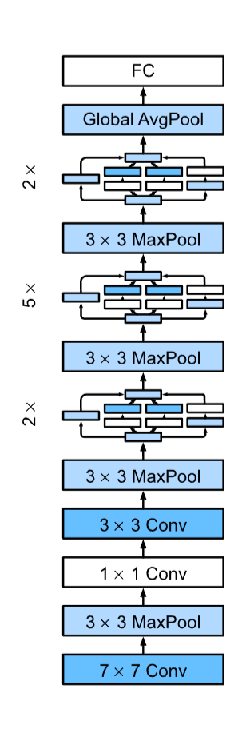

# 8.Modern Convolutional Neural Networks


1.  **开启现代CNN架构之旅**
(I) 本章将"游览"一系列现代CNN架构，了解如何将基础的CNN层"装配"起来。
(II) 这些架构是 **直觉**、**数学** 和大量 **试错** 的产物。
(III) 本章将按时间顺序介绍这些模型，以帮助你建立对该领域历史和发展方向的直觉。
(IV) 介绍的模型将包括：
--- (A) AlexNet
--- (B) VGG (使用重复块)
--- (C) NiN (网络中的网络)
--- (D) GoogLeNet (使用多分支卷积)
--- (E) ResNet (残差网络)
--- (F) ResNeXt (ResNet的稀疏连接泛化)
--- (G) DenseNet (稠密网络)

2.  **现代CNN的重要性**
(I) 它们不仅可以直接用于视觉任务。
(II) 它们还经常作为更高级任务的 **基础特征生成器**，例如：
--- (A) 追踪 (Tracking)
--- (B) 分割 (Segmentation)
--- (C) 目标检测 (Object detection)
--- (D) 风格迁移 (Style transfer)
(III) 许多模型曾是 **ImageNet** 竞赛的获胜者或亚军，该竞赛是衡量监督学习进展的“晴雨表”。

3.  **核心思想与关键技术**
(I) 尽管 **深度神经网络** 的理念（堆叠层）很简单，但不同的架构和超参数会导致性能差异巨大。
(II) **批量规范化 (Batch Normalization)** 和 **残差连接 (Residual Connections)** 是本章介绍的两个重要思想，它们对训练和设计深度模型至关重要，且应用已超越计算机视觉。
(III) **训练技术** (如优化器、数据增强、正则化) 对提高模型准确性起着关键作用。

4.  **架构的演进与未来趋势**
(I) 架构的演进方向之一是 **自动化搜索** 高效网络，例如 MobileNet v3 和 RegNetX/Y。
(II) 这种探索结合了 **蛮力计算** 和实验者的 **巧妙设计**。
(III) 随着计算和数据的增加，一些 **长期存在的假设** (例如卷积窗口的大小) 可能需要被重新审视。
(IV) **Transformers** (如 Swin Transformer) 最近已开始在视觉领域取代CNN，这部分将在第11章讨论。
---
## 8.1 Deep Convolutional Neural Networks (AlexNet)

1.  **ML 与 CV 领域的观点分歧**
    (I) **机器学习 (ML) 研究者**：
    \--- (A) 认为 ML 是"优雅的"、"严谨的"且"有用的"。
    \--- (B) 他们的研究主流是 **优雅的理论** 和 **凸优化 (convex optimization)**。
    (II) **计算机视觉 (CV) 研究者**：
    \--- (A) 认为 CV 的进步是由 **特征 (features)**、**几何 (geometry)** 和 **工程 (engineering)** 驱动的，而非新颖的学习算法。
    \--- (B) 他们坚信，一个 **稍大或更干净的数据集**，或一个 **稍加改进的特征提取方法**，对最终准确率的影响远大于任何学习算法。

2.  **核心范式："手工" 制作特征 (Feature Crafting)**
    (I) 在 AlexNet (2012) 之前，CNNs 并非主流。
    \--- (A) LeNet (1995) 虽已问世，但在更大、更现实的数据集上训练的可行性尚未被证实。
    \--- (B) 在此期间，神经网络常被其他 ML 方法（如核方法、集成方法）超越。
    (II) 传统的 CV 方法 **不是端到端 (end-to-end)** 的（即从像素到分类）。
    (III) 关键区别：**特征不是被“学习”出来的，而是被“手工制作” (crafted) 出来的**。
    (IV) 大部分进展依赖于：
    \--- (A) 更巧妙的特征提取思路。
    \--- (B) 对几何学的深刻见解。
    (V) 学习算法（分类器）通常被认为是“事后才考虑的” (an afterthought)。

3.  **经典的 CV "手工" 工作流四步**
    (I) 1. **获取数据集**：在早期，这很困难且昂贵（例如 1994 年的相机只有 0.3MP 分辨率，存储 8 张照片，售价 1000 美元）。
    (II) 2. **预处理**：基于光学、几何学等知识，使用 **手工制作的特征** 对数据集进行预处理。
    (III) 3. **特征提取**：将数据送入标准的特征提取器，如 **SIFT**、**SURF** 或其他 **手动调整** 的管线。
    (IV) 4. **训练分类器**：将提取出的特征表示“塞入”一个分类器（如线性模型或核方法）中进行训练。

4.  **CNNs 早期未能普及的障碍**
    (I) **计算能力不足**：
    \--- (A) 1990 年代的加速器（如 1999 年的 GeForce 256）性能孱弱（约 480 MFLOPS），远非今日（1000+ TFLOPs）可比。
    \--- (B) 缺乏用于深度学习的编程框架。
    (II) **数据集规模小**：
    \--- (A) 当时，在 6 万张 28x28 像素的低分辨率图像上进行 OCR 仍被视为一项极具挑战性的任务。
    (III) **关键训练技巧的缺失**：
    \--- (A) 有效的 **参数初始化** 启发法。
    \--- (B) 随机梯度下降的 **高级变体** (如 Adam)。
    \--- (C) **非压缩激活函数** (Non-squashing activations，如 ReLU)。
    \--- (D) **有效的正则化技术** (如 Dropout)。

5.  **本章的 Python 导入**
    (I) 笔记和代码实现将使用以下库：

<!-- end list -->

```python
# 导入 PyTorch 库
import torch
# 导入 PyTorch 的神经网络模块
from torch import nn
# 导入 "Dive into Deep Learning" (d2l) 库
from d2l import torch as d2l
```
---
### 8.1.1 Representation Learning

1.  **理念的转变：从“手工制作”到“表示学习” (Representation Learning)**
(I) **传统方法的局限**：
--- (A) 在 2012 年之前，CV 管线(pipeline)中最重要的部分——“表示” (representation)，主要是“机械地” (mechanically) 计算出来的。
--- (B) 当时的研究主流是设计新的特征函数，例如 SIFT、SURF、HOG 等“手工特征”提取器。
(II) **新的理念：特征应该被学习**
--- (A) 另一组研究者 (如 LeCun, Hinton, Bengio) 坚信 **特征本身就应该被学习 (ought to be learned)**。
--- (B) 他们认为，特征应该通过多个可共同学习的层，进行 **分层组合 (hierarchically composed)**。
(III) **CNN 的分层表示（以 AlexNet 为例）**
--- (A) **底层网络**：学习到的特征提取器类似于传统滤波器，用于检测边缘、颜色和纹理。
--- (B) **更高层网络**：在底层表示的基础上，构建更大的结构（如眼睛、鼻子）。
--- (C) **更高层网络**：代表完整的物体（如人、飞机、狗）。
--- (D) **最终隐藏状态**：学习到图像的 **紧凑表示 (compact representation)**，总结其内容，以便轻松分离不同类别。

2.  **缺失的要素 (一): 数据 (Data)**
(I) **过去的困境：数据集微小**
--- (A) 深度模型需要 **大规模数据** 才能超越传统的凸优化方法。
--- (B) 1990 年代，受限于存储、传感器成本和预算，研究依赖于 **微型数据集**（几百或几千张低分辨率、背景干净的图像）。
(II) **改变局势者：ImageNet**
--- (A) **ImageNet (2009)** 成为了一个关键的挑战。
--- (B) **规模史无前例**：超过 100 万个样本，1000 个类别。
--- (C) **图像分辨率相对较高** (224x224)，允许学习更丰富的特征。
--- (D) **ImageNet 挑战赛 (ILSVRC)** 推动了 CV 领域去寻找更大规模下表现最好的模型。

3.  **缺失的要素 (二): 硬件 (Hardware)**
(I) **深度学习的计算瓶颈**
--- (A) 深度模型是“贪婪的”计算消费者，训练涉及大量高代价的线性代数运算。
--- (B) 这是 1990 年代和 2000 年代初，人们更喜欢简单、高效算法（如凸优化）的主要原因。
(II) **改变局势者：GPU**
--- (A) **图形处理器 (GPU)** 使深度学习变得 **可行**。
--- (B) GPU 最初为游戏开发，优化了 $4 \times 4$ 矩阵向量乘积，这与卷积层所需的数学运算惊人地相似。
--- (C) NVIDIA 和 ATI 开始将其作为 **通用GPU (GPGPU)** 进行市场推广。
(III) **为什么 GPU 远快于 CPU**
--- (A) **CPU (中央处理器)**：拥有 **少量** (如 4-8 个) **强大** 的核心。擅长复杂的控制流，但昂贵且（在并行计算上）低效。
--- (B) **GPU (图形处理器)**：拥有 **数千个** (如 NVIDIA Ampere 架构有 6912 个 CUDA 核心) **小型、简单** 的处理元件。
--- (C) **功耗优势**：功耗随频率 **二次方** 增长。用 16 个 1/4 速度的核心，可获得 4 倍性能（$16 \times 1/4=4$），而功耗相近。
--- (D) **内存带宽**：GPU 拥有极高的内存带宽（通常是 CPU 的 10 倍以上），这对深度学习至关重要。
(IV) **2012 年的突破：AlexNet 的实现**
--- (A) Krizhevsky 和 Sutskever 意识到 CNN 的计算瓶颈（卷积）都是可并行的操作。
--- (B) 他们使用 **两块 NVIDIA GTX 580** 显卡（每块 1.5 TFLOPs，这在当时 CPU 难以企及）实现了快速卷积。
--- (C) 他们的 `cuda-convnet` 代码在几年内成为了行业标准，开启了深度学习的热潮。

4.  **AlexNet (2012) vs. LeNet (1995)**
(I) AlexNet 是 LeNet 的“进化版改进”，两者共享许多架构元素。
(II) **为什么过了近20年才成功？**
(III) 关键区别在于：**数据量** (ImageNet) 和 **计算能力** (GPU) 在这期间有了显著增长。
(IV) AlexNet 网络更大，在快得多的 GPU 上（相较于 1995 年的 CPU）训练了多得多的数据。

---
### 8.1.2 AlexNet
1.  **AlexNet 的历史地位**
    (I) 它在 2012 年 ImageNet 挑战赛中以 **巨大优势** 获胜。
    (II) 它首次证明了：**学习到的特征 (Learned features) 可以超越手工设计的特征 (Manually-designed features)**。
    (III) 这打破了计算机视觉领域的旧范式。

2.  **架构概览：AlexNet vs. LeNet**
    (I) **深度对比**：AlexNet 比 LeNet 深得多。
    \--- (A) AlexNet 包含 **8 层**：5 个卷积层 + 2 个全连接隐藏层 + 1 个全连接输出层。
    (II) **激活函数**：AlexNet 使用 **ReLU** 替代了传统的 Sigmoid。
    (III) **通道数**：AlexNet 的卷积通道数是 LeNet 的 10 倍。

3.  **详细层级设计 (Architecture Details)**
    (I) **第一层卷积：大窗口**
    \--- (A) 使用 **$11 \times 11$** 的卷积窗口。
    \--- (B) **原因**：ImageNet 图像 (224x224) 比 MNIST (28x28) 大得多，物体占据更多像素，需要更大的窗口来捕捉物体细节。
    (II) **后续卷积层**
    \--- (A) 第二层窗口减小为 $5 \times 5$。
    \--- (B) 紧接着是三个 $3 \times 3$ 的卷积层。
    (III) **池化层 (Pooling)**
    \--- (A) 在第 1、2、5 个卷积层之后，使用了 **最大池化层 (Max Pooling)**。
    \--- (B) 窗口大小 $3 \times 3$，步幅 (stride) 为 2。
    (IV) **全连接层 (Fully Connected)**
    \--- (A) 最后有两个巨大的全连接层，各有 **4096** 个输出。
    \--- (B) **代价**：这部分参数极其庞大，需要近 1GB 的显存。

4.  **关键创新点：激活函数与正则化**
    (I) **使用 ReLU 激活函数** (Rectified Linear Unit)
    \--- (A) **计算更简单**：不需要像 Sigmoid 那样做昂贵的指数运算。
    \--- (B) **训练更容易**：解决了梯度消失问题。Sigmoid 在输出接近 0 或 1 时梯度几乎为 0；而 ReLU 在正区间的梯度始终为 1，模型能更有效地更新参数。
    (II) **容量控制与预处理**
    \--- (A) **Dropout**：为了控制巨大的全连接层的过拟合，AlexNet 引入了 Dropout 技术（LeNet 只用了权重衰减）。
    \--- (B) **数据增强 (Data Augmentation)**：在训练中使用了图像翻转 (flipping)、裁剪 (clipping) 和颜色变化，使模型更鲁棒并扩大了样本量。

5.  **实现代码 (PyTorch)**
    这里是 AlexNet 的完整结构实现。注意：为了适应单 GPU，这里使用了简化版本（原版是双 GPU 设计），并使用了 `LazyConv2d` 自动推断输入形状。

<!-- end list -->

```python
class AlexNet(d2l.Classifier):
    def __init__(self, lr=0.1, num_classes=10):
        super().__init__()
        self.save_hyperparameters()
        self.net = nn.Sequential(
            # [第一层] 卷积层：输入图像较大(224x224)，使用11x11大核，步幅4大幅减小尺寸
            # 输出通道96，随后接ReLU和最大池化(3x3, 步幅2)
            nn.LazyConv2d(96, kernel_size=11, stride=4, padding=1),
            nn.ReLU(), 
            nn.MaxPool2d(kernel_size=3, stride=2),
            
            # [第二层] 卷积层：减小核到5x5，填充2以维持尺寸，增加通道到256
            # 同样接ReLU和最大池化
            nn.LazyConv2d(256, kernel_size=5, padding=2), 
            nn.ReLU(),
            nn.MaxPool2d(kernel_size=3, stride=2),
            
            # [第三、四、五层] 连续三个卷积层：
            # 核大小均为3x3，通道数在384和256之间变化
            # 注意：前两个卷积层后没有池化层，直接进行特征提取
            nn.LazyConv2d(384, kernel_size=3, padding=1), nn.ReLU(),
            nn.LazyConv2d(384, kernel_size=3, padding=1), nn.ReLU(),
            nn.LazyConv2d(256, kernel_size=3, padding=1), nn.ReLU(),nn.MaxPool2d(kernel_size=3, stride=2), 
            # [第五层后] 接最大池化层，并在进入全连接层前展平
            nn.Flatten(),
            
            # [全连接层 1] 巨大的隐藏层，输出4096，使用Dropout(0.5)防止过拟合
            nn.LazyLinear(4096), nn.ReLU(), nn.Dropout(p=0.5),
            
            # [全连接层 2] 同样的结构，再次映射到4096
            nn.LazyLinear(4096), nn.ReLU(), nn.Dropout(p=0.5),
            
            # [输出层] 映射到类别数 (例如 Fashion-MNIST 为 10)
            nn.LazyLinear(num_classes)
        )
        # 初始化参数
        self.net.apply(d2l.init_cnn)
```

6.  **层状输出形状观察**
    (I) 如果我们构建一个单通道、224x224 的数据样本传入网络，各层的输出形状变化如下（对应图片中的 `layer_summary`）：

| 层级 (Layer) | 操作 (Operation) | 输出形状 (Output Shape) | 备注 (Note) |
| :--- | :--- | :--- | :--- |
| **Input** | - | (1, 1, 224, 224) | 原始输入 |
| **Layer 1** | Conv2d + MaxPool | (1, 96, 26, 26) | 尺寸急剧缩小 ($224 \to 54 \to 26$) |
| **Layer 2** | Conv2d + MaxPool | (1, 256, 12, 12) | 通道增加，尺寸减半 |
| **Layer 3-4** | Conv2d | (1, 384, 12, 12) | 尺寸不变，提取深层特征 |
| **Layer 5** | Conv2d + MaxPool | (1, 256, 5, 5) | 最终特征图大小为 $5 \times 5$ |
| **Flatten** | Flatten | (1, 6400) | $256 \times 5 \times 5 = 6400$ |
| **FC 1** | Linear | (1, 4096) | 第一次全连接 |
| **FC 2** | Linear | (1, 4096) | 第二次全连接 |
| **Output** | Linear | (1, 10) | 最终分类结果 |


**总结**：
AlexNet 的核心在于“大”和“深”。

1.  **大**：大卷积核 (11x11)，大通道数，大参数量 (FC层)。
2.  **深**：比之前的网络都深。
3.  **稳**：用 ReLU 和 Dropout 保证这么大的网络能训练得动且不过拟合。
---
### 8.1.3 Training
1.  **数据集的选择**
    (I) 原版 AlexNet 是在 **ImageNet** 上训练的。
    (II) 本教程使用 **Fashion-MNIST** 代替。
    \--- (A) 原因：训练完整的 ImageNet 模型即使在现代 GPU 上也需要数小时甚至数天，不适合教学演示。

2.  **分辨率适配 (Upsampling)**
    (I) **问题**：Fashion-MNIST 的图像分辨率 ($28 \times 28$) 远小于 AlexNet 设计时面向的 ImageNet 分辨率。
    (II) **解决方案**：将图像 **上采样 (upsample)** 调整为 **$224 \times 224$**。
    (III) **评价**：这通常不是一种高效的做法，因为它增加了计算复杂度却并未增加有效信息，但为了 **忠实还原 AlexNet 的架构**，这里必须进行调整。
    (IV) **实现**：通过在 `d2l.FashionMNIST` 构造函数中使用 `resize` 参数来实现。

3.  **训练配置与性能**
    (I) 与之前的 LeNet 相比，训练的主要变化：
    \--- (A) 使用了 **更小的学习率 (learning rate)**。
    \--- (B) 训练过程 **慢得多**。
    (II) **原因**：网络更深更宽 (deeper and wider)、图像分辨率更高、卷积运算更昂贵。

4.  **代码实现**

<!-- end list -->

```python
#代码块
model = AlexNet(lr=0.01)
# 加载 Fashion-MNIST 数据集，并将图像强制调整(resize)为 224x224 以匹配 AlexNet 输入
data = d2l.FashionMNIST(batch_size=128, resize=(224, 224))
# 初始化训练器，设置最大迭代轮数为 10，使用单 GPU
trainer = d2l.Trainer(max_epochs=10, num_gpus=1)
# 开始训练
trainer.fit(model, data)
```

---    
### 8.1.4 Discussion

1.  **AlexNet 与 LeNet 的关系**
(I) AlexNet 在结构上与 LeNet 惊人地相似。
(II) 但它包含了两个关键改进：
--- (A) **准确性 (Accuracy)**：引入了 **Dropout**。
--- (B) **易训练性 (Ease of training)**：使用了 **ReLU**。

2.  **AlexNet 的“阿喀琉斯之踵” (效率瓶颈)**
(I) **巨大的全连接层** 是其效率上的致命弱点 (Achilles heel)。
(II) 具体代价：
--- (A) 最后两个隐藏层需要巨大的矩阵运算 ($6400 \times 4096$ 和 $4096 \times 4096$)。
--- (B) 这相当于 **164 MB** 的内存占用和 **81 MFLOPs** 的计算量。
(III) 后果：这种开销对于移动手机等小型设备来说是巨大的，这也是为什么 AlexNet 后来被更高效的架构（如后续章节将介绍的模型）所超越的原因。

3.  **工具与实现的演进**
(I) **效率对比**：2012 年需要几个月的工作量，现在使用现代框架只需十几行代码即可完成。
(II) **普及缓慢的原因**：学术界花了数年才接受这一概念转变，部分原因是当时缺乏高效的计算工具。
--- (A) 当时 **DistBelief** (Google) 和 **Caffe** 尚未问世。
--- (B) **Theano** 还缺乏许多特性。
--- (C) 直到 **TensorFlow** 等框架的出现，局面才发生了戏剧性的改变。

4.  **从浅层到深层的关键跨越**
(I) 尽管在实验中参数量 (4000万+) 远超训练数据量 (6万张图像)，但模型几乎没有 **过拟合**。
(II) 这归功于现代深度网络设计中固有的 **改进正则化技术** (如 Dropout)。
(III) AlexNet 标志着从浅层网络向如今使用的 **深层网络** 迈出了关键的一步。

---
## 8.2 Networks Using Blocks (VGG)

1.  **AlexNet 的局限与设计哲学的转变**
(I) **AlexNet 的贡献**：提供了经验证据，证明深层 CNN 可以取得很好的结果。
(II) **AlexNet 的不足**：它没有提供一个设计新网络的 **通用模板 (general template)**。
(III) **新的方向**：接下来的章节将介绍用于设计深度网络的通用 **启发式概念 (heuristic concepts)**。

2.  **抽象层级的演进 (类比 VLSI 芯片设计)**
(I) 神经网络设计的发展轨迹与 VLSI (超大规模集成电路) 设计惊人地相似：
--- (A) **从底层到高层**：从考虑单个 **神经元 (neurons)** $\rightarrow$ 整个 **层 (layers)** $\rightarrow$ **块 (blocks)** (重复的层模式)。
(II) **基础模型 (Foundation Models)**：
--- (A) 十年后的今天，这一抽象已进一步发展。
--- (B) 研究者开始使用庞大的预训练模型（即基础模型）来重新调整用途，解决不同但相关的任务。

3.  **VGG 网络与“块” (Block) 的诞生**
(I) **起源**：使用“块”的想法最早由牛津大学的 **Visual Geometry Group (VGG)** 提出 (Simonyan & Zisserman, 2014)。
(II) **核心思想**：通过使用 **循环 (loops)** 和 **子程序 (subroutines)**，可以非常容易地在代码中实现这些 **重复结构**。

**简单总结：**
如果不使用“块”的概念，设计深层网络就像是用一个个晶体管去拼CPU；而使用了“块”之后，就像是用现成的逻辑门模块去搭积木，不仅设计更清晰，写代码（用循环）也更方便。
```python
import torch
from torch import nn
from d2l import torch as d2l
```
---
### 8.2.1 VGG Blocks

1.  **传统 CNN 构建方式的问题**
    (I) **传统结构**：通常是一个卷积层 (Conv) -\> 非线性层 (ReLU) -\> 池化层 (Pooling) 的序列。
    (II) **缺陷**：空间分辨率下降得太快。
    \--- (A) 每次池化都会使高宽减半。
    \--- (B) 这导致在分辨率耗尽之前，网络最多只能有 $\log_2 d$ 个卷积层（例如 ImageNet 只能容纳约 8 层）。

2.  **VGG 的核心理念 (Simonyan & Zisserman, 2014)**
    (I) **创新点**：在下采样（池化）之前，连续使用 **多个** 卷积层。
    (II) **"深而窄" vs "浅而宽"**：
    \--- (A) **感受野等效**：连续两个 $3 \times 3$ 卷积核看到的像素范围（感受野）与一个 $5 \times 5$ 卷积核相同。
    \--- (B) **性能对比**：研究表明，**深而窄** (Deep and Narrow) 的网络性能显著优于浅层网络。
    (III) **黄金标准**：堆叠 $3 \times 3$ 卷积层成为了后来深度网络的“黄金标准”。

3.  **VGG 块的具体结构**
    (I) **卷积部分**：包含一系列 $3 \times 3$ 卷积核。
    \--- (A) 关键设置：`padding=1`。这保证了卷积操作 **不改变** 图像的高和宽。
    (II) **激活部分**：每一层卷积后都接一个 ReLU。
    (III) **池化部分**：块的最后是一个 $2 \times 2$ 最大池化层。
    \--- (A) 关键设置：`stride=2`。这一步将图像的高和宽 **减半**。

4.  **代码实现**
    该函数通过循环堆叠指定数量的卷积层，最后加上池化层，封装成一个 `nn.Sequential` 块。

<!-- end list -->

```python
def vgg_block(num_convs, out_channels):
    layers = []
    # 循环生成指定数量的卷积层
    for _ in range(num_convs):
        # 使用 3x3 卷积，padding=1 保证图片尺寸不变
        layers.append(nn.LazyConv2d(out_channels, kernel_size=3, padding=1))
        layers.append(nn.ReLU())
    # 在所有卷积层之后，添加一个最大池化层，将图片尺寸减半
    layers.append(nn.MaxPool2d(kernel_size=2, stride=2))
    
    # 将列表中的层解包并封装成一个 Sequential 容器返回
    return nn.Sequential(*layers)
```

### 8.2.2 VGG Network

1.  **整体架构设计**
    (I) 与 AlexNet 和 LeNet 类似，VGG 网络也可以分为两部分：
    \--- (A) 第一部分：主要由 **卷积层** 和 **池化层** 组成。
    \--- (B) 第二部分：由 **全连接层** 组成（这部分与 AlexNet 完全相同）。
    (II) **核心区别**：AlexNet 的层是单独设计的，而 VGG 由 **层块 (Blocks of layers)** 组成。
    (III) **设计模式**：
    \--- (A) 卷积层被分组为非线性变换(conv+ReLU)，且保持维度不变（通过 padding=1）。
    \--- (B) 每组之后紧跟一个分辨率降低步骤（通过池化）。
    (IV) 这种设计使得 VGG 定义了一个 **网络家族 (Family of networks)** 而不仅仅是一个特定的模型。现在的惯例是提出一系列在速度和精度之间权衡的网络变体。

2.  **VGG-11 架构详情**
    (I) **命名由来**：原始 VGG 网络包含 5 个卷积块，共有 8 个卷积层和 3 个全连接层，因此被称为 **VGG-11**。
    (II) **块的配置**：
    \--- (A) 前两个块：各包含 **1** 个卷积层。
    \--- (B) 后三个块：各包含 **2** 个卷积层。
    (III) **通道数变化**：
    \--- (A) 第一个块输出 **64** 通道。
    \--- (B) 随后的每个块将输出通道数 **翻倍**，直到达到 **512**。
    \--- (C) 路径：$64 \rightarrow 128 \rightarrow 256 \rightarrow 512 \rightarrow 512$。

3.  **维度变化策略**
    (I) 每一个 VGG 块都会将图像的高度和宽度 **减半**。
    (II) 最终进入全连接层之前，特征图的大小变为 **$7 \times 7$**。
    (III) 随后数据被展平 (Flatten)，送入与 AlexNet 相同的全连接层架构（两个 4096 隐藏层 + 1 个输出层）。

4.  **代码实现**
    VGG 类可以通过传入 `arch` (架构配置列表) 来动态生成不同深度的 VGG 网络。

<!-- end list -->

```python
class VGG(d2l.Classifier):
    def __init__(self, arch, lr=0.1, num_classes=10):
        super().__init__()
        self.save_hyperparameters()
        conv_blks = []
        # 循环遍历架构配置 arch
        # arch 格式例如: ((1, 64), (1, 128), (2, 256), (2, 512), (2, 512))
        for (num_convs, out_channels) in arch:
            # 调用之前定义的 vgg_block 生成一个块，并添加到列表中
            conv_blks.append(vgg_block(num_convs, out_channels))
            
        self.net = nn.Sequential(
            # 解包列表，将所有卷积块串联
            *conv_blks, 
            # 展平层，将多维特征图转换为向量
            nn.Flatten(),
            # 全连接部分 (与 AlexNet 相同)
            # 第一个全连接层，输出 4096
            nn.LazyLinear(4096), nn.ReLU(), nn.Dropout(0.5),
            # 第二个全连接层，输出 4096
            nn.LazyLinear(4096), nn.ReLU(), nn.Dropout(0.5),
            # 输出层
            nn.LazyLinear(num_classes)
        )
        self.net.apply(d2l.init_cnn)
```

5.  **层级输出形状观察 (VGG-11)**
    输入为 $224 \times 224$ 时：
    (I) **Block 1**: $(1, 64, 112, 112)$ - 尺寸减半
    (II) **Block 2**: $(1, 128, 56, 56)$ - 尺寸减半
    (III) **Block 3**: $(1, 256, 28, 28)$ - 尺寸减半
    (IV) **Block 4**: $(1, 512, 14, 14)$ - 尺寸减半
    (V) **Block 5**: $(1, 512, 7, 7)$ - 尺寸减半，最终特征图
    (VI) **Flatten**: $512 \times 7 \times 7 = 25088$

---
###  8.2.3 Training

1.  **计算压力与模型调整**
    (I) **问题**：VGG-11 的计算量比 AlexNet 大得多，训练成本很高。
    (II) **解决方案**：构建一个 **通道数较少** 的 VGG 网络版本。
    \--- (A) 将原版的通道数（64 -\> 512）大幅减少（16 -\> 128）。
    (III) **适用性**：这种“瘦身版”网络对于 **Fashion-MNIST** 数据集来说已经足够强大。

2.  **训练过程观察**
    (I) 流程与 8.1 节中的 AlexNet 训练相似。
    (II) **结果分析**：验证损失 (validation loss) 与训练损失 (training loss) 非常接近。
    (III) **结论**：这表明模型几乎 **没有过拟合 (little overfitting)**。

3.  **代码实现**
    这里定义了一个通道数减小的 VGG 架构进行训练。

<!-- end list -->

```python
# 定义一个"瘦身版"的 VGG-11
# 原始 VGG-11 通道通常是: 64 -> 128 -> 256 -> 512 -> 512
# 这里为了加速演示，改成了: 16 -> 32 -> 64 -> 128 -> 128
arch_small = ((1, 16), (1, 32), (2, 64), (2, 128), (2, 128))

# 初始化模型，设置学习率为 0.01
model = VGG(arch=arch_small, lr=0.01)

# 初始化训练器 (10轮, 单GPU)
trainer = d2l.Trainer(max_epochs=10, num_gpus=1)

# 加载数据，同样需要 resize 到 224x224 以匹配 VGG 输入要求
data = d2l.FashionMNIST(batch_size=128, resize=(224, 224))

# 初始化模型参数
# 注意：这里通过从 data loader 获取一个 batch 来推断输入形状，从而进行懒加载初始化
model.apply_init([next(iter(data.get_dataloader(True)))[0]], d2l.init_cnn)

# 开始训练
trainer.fit(model, data)
```

---
### 8.2.4 Summary

1.  **VGG 的历史地位：真正的现代 CNN**
(I) 虽然 AlexNet 引入了大规模深度学习的组件，但 **VGG** 被认为是第一个 **真正的现代卷积神经网络**。
(II) 它确立了两个现代深度学习的关键特性：
--- (A) 使用 **多卷积层的块 (Blocks of multiple convolutions)**。
--- (B) 偏好 **“深而窄” (deep and narrow)** 的网络结构。

2.  **模型家族的概念**
(I) VGG 是第一个定义了 **一系列 (entire family)** 相似参数化模型的网络，而不仅仅是一个单一的架构。
(II) 这允许从业者在 **复杂度 (complexity)** 和 **速度 (speed)** 之间进行充分的权衡 (trade-off)。

3.  **深度学习框架的进步**
(I) VGG 的设计体现了现代深度学习框架的优势。
(II) 过去需要编写繁琐的 **XML 配置文件** 来指定网络，而现在只需要简单的 **Python 代码** 即可组装网络。

4.  **未来的反思：ParNet 与浅层网络**
(I) 最近的研究 (如 **ParNet**, 2021) 展示了反向趋势：通过大量 **并行计算**，使用 **更浅 (shallow)** 的架构也能达到具有竞争力的性能。
(II) 这是一个令人兴奋的发展，可能会影响未来的架构设计。
(III) 但在本章的剩余部分，我们将继续沿着过去十年的 **科学进步路径**（即向**更深层网络发展**）继续学习。

---
## 8.3 Network in Network (NiN)

1.  **传统设计模式的通病 (LeNet, AlexNet, VGG)**
(I) **共同模式**：
--- (A) 前段：通过一系列卷积层和池化层利用 **空间结构 (spatial structure)** 提取特征。
--- (B) 后段：通过 **全连接层 (fully connected layers)** 对表示进行后处理。
(II) **演进方式**：AlexNet 和 VGG 对 LeNet 的改进主要在于让这两个模块变得 **更宽 (widen)** 和 **更深 (deepen)**。

2.  **这种设计面临的两大挑战**
(I) **挑战一：参数量巨大的全连接层**
--- (A) 架构末端的全连接层消耗了 **极其庞大** 的参数量。
--- (B) **案例**：即使是简单的 VGG-11，其全连接层矩阵也需要约 **400MB** 的显存 (单精度 FP32)。
--- (C) **后果**：这严重阻碍了在 **移动和嵌入式设备** 上的计算（例如 VGG 发明时的 iPhone 4S 总共只有 512MB 内存），很难证明为了一个图像分类器占用设备的大部分内存是合理的。
(II) **挑战二：难以增加早期非线性**
--- (A) 无法在网络早期添加全连接层来增加 **非线性程度 (degree of nonlinearity)**。
--- (B) 原因：这样做会破坏图像的 **空间结构**，并可能需要更多的内存。

3.  **NiN 的解决方案**
(I) **核心策略**：NiN 块 (Lin et al., 2013) 提供了一个简单的策略来同时解决上述两个问题。
(II) **两大洞见**：
--- (A) 使用 **$1 \times 1$ 卷积**：在通道之间添加 **局部非线性 (local nonlinearities)**。（这相当于在每个像素位置上独立地运行一个小型的全连接层，而不破坏空间结构）。
--- (B) 使用 **全局平均池化 (global average pooling)**：在最后的表示层，对所有位置的信息进行整合，替代巨大的全连接层。
(III) **注**：如果不是因为增加了非线性（通过 $1 \times 1$ 卷积），单靠全局平均池化是无效的。
```python
import torch
from torch import nn
from d2l import torch as d2l
```
---

### 8.3.1 NiN Blocks
1.  **背景回顾：张量形状**
    (I) **卷积层**：输入和输出是 **4D 张量** (样本数, 通道数, 高, 宽)。
    (II) **全连接层**：输入和输出通常是 **2D 张量** (样本数, 特征数)。

2.  **NiN 的核心理念**
    (I) **核心思想**：在 **每个像素位置** (针对每个高和宽) 应用一个全连接层。
    (II) **实现方式**：使用 **$1 \times 1$ 卷积**。
    \--- (A) $1 \times 1$ 卷积可以被看作是一个 **全连接层**，它独立地作用于每个像素位置，在该位置的不同通道之间进行线性组合。

3.  **NiN Block vs. VGG Block**
    (I) **结构差异**：
    \--- (A) **VGG 块**：由堆叠的 $3 \times 3$ 卷积层组成。
    \--- (B) **NiN 块**：由 **1个普通卷积层** (例如 $3 \times 3$ 或 $5 \times 5$) 后面紧跟 **2个 $1 \times 1$ 卷积层** 组成。
    (II) **目的**：这两个 $1 \times 1$ 卷积层充当了带有 ReLU 激活函数的全连接层，用于增加非线性特征提取能力。
    (III) **整体架构**：NiN 在最后不再需要巨大的全连接层，大大减少了参数量。

4.  **代码实现**
    `nin_block` 函数由一个普通卷积层和两个充当全连接层的 $1 \times 1$ 卷积层链接而成。

<!-- end list -->

```python
#代码块
def nin_block(out_channels, kernel_size, strides, padding):
    return nn.Sequential(
        # 1. 普通的卷积层：用于提取空间特征
        nn.LazyConv2d(out_channels, kernel_size, strides, padding), nn.ReLU(),
        # 2. 第一个 1x1 卷积层：充当像素级的全连接层，增加非线性
        nn.LazyConv2d(out_channels, kernel_size=1), nn.ReLU(),
        # 3. 第二个 1x1 卷积层：再次充当全连接层，进一步增加非线性
        nn.LazyConv2d(out_channels, kernel_size=1), nn.ReLU())
```

---
### 8.3.2 NiN(Network in Network) Model

1.  **与 AlexNet 的传承关系**
    (I) **卷积核设置**：NiN 使用了与 AlexNet 相同的初始卷积核尺寸（分别是 $11 \times 11$, $5 \times 5$, 和 $3 \times 3$）。
    \--- (A) 原因：NiN 是在 AlexNet 之后不久提出的，借鉴了其设计参数。
    (II) **输出通道**：通道数也与 AlexNet 保持一致。
    (III) **池化层**：每个 NiN 块之后都紧跟一个最大池化层 (Max Pooling)，窗口大小 $3 \times 3$，步幅为 2。

2.  **核心差异：完全摒弃全连接层**
    (I) **设计变革**：NiN 与 AlexNet/VGG 最大的区别在于它 **完全避免了使用全连接层**。
    (II) **替代方案：全局平均池化 (Global Average Pooling)**
    \--- (A) **最后一块的设计**：将最后一个 NiN 块的输出通道数设置为等于 **标签类别数** (num\_classes，例如 10)。
    \--- (B) **池化操作**：紧接着应用一个全局平均池化层，将每个通道的整个空间平面 (高 $\times$ 宽) 平均成一个值。
    \--- (C) **结果**：直接生成 logits 向量（即分类的预测分数）。
    (III) **优缺点**：
    \--- (A) **优点**：显著 **减少了模型参数量** (因为没有了巨大的全连接矩阵)。
    \--- (B) **缺点**：可能会导致训练时间略有增加。

3.  **代码实现**
    NiN 的整体结构是由堆叠的 `nin_block` 和池化层组成的。

<!-- end list -->

```python
class NiN(d2l.Classifier):
    def __init__(self, lr=0.1, num_classes=10):
        super().__init__()
        self.save_hyperparameters()
        self.net = nn.Sequential(
            # --- 第 1 阶段 ---
            # 类似 AlexNet 第一层：大核 11x11，步幅 4，输出 96 通道
            nin_block(96, kernel_size=11, strides=4, padding=0),
            nn.MaxPool2d(3, stride=2),
            
            # --- 第 2 阶段 ---
            # 核 5x5，输出 256 通道
            nin_block(256, kernel_size=5, strides=1, padding=2),
            nn.MaxPool2d(3, stride=2),
            
            # --- 第 3 阶段 ---
            # 核 3x3，输出 384 通道
            nin_block(384, kernel_size=3, strides=1, padding=1),
            nn.MaxPool2d(3, stride=2),
            
            # --- 正则化 ---
            # 在最后分类前使用 Dropout 减少过拟合
            nn.Dropout(0.5),
            
            # --- 第 4 阶段 (分类头) ---
            # 注意：这里输出通道数 = 类别数 (num_classes)
            nin_block(num_classes, kernel_size=3, strides=1, padding=1),
            
            # --- 全局平均池化 ---
            # 将每个通道 (5x5) 压缩为 1x1 的标量
            nn.AdaptiveAvgPool2d((1, 1)),
            
            # --- 展平 ---
            # 将 (Batch, 10, 1, 1) 展平为 (Batch, 10) 以输出结果
            nn.Flatten())
        self.net.apply(d2l.init_cnn)
```

4.  **层级输出形状观察**
    输入为 $224 \times 224$ 时的数据流向：

| 层级 (Stage) | 操作 | 输出形状 | 备注 |
| :--- | :--- | :--- | :--- |
| **Input** | - | (1, 1, 224, 224) | 原始输入 |
| **Block 1** | Conv + Pool | (1, 96, 26, 26) | 空间尺寸急剧减小 |
| **Block 2** | Conv + Pool | (1, 256, 12, 12) | 通道增加，尺寸减半 |
| **Block 3** | Conv + Pool | (1, 384, 5, 5) | 尺寸进一步减小 |
| **Dropout** | Dropout | (1, 384, 5, 5) | 形状不变 |
| **Block 4** | NiN Block | **(1, 10, 5, 5)** | 通道数变为类别数 (10) |
| **GAP** | AdaptiveAvgPool | **(1, 10, 1, 1)** | 全局平均，空间变为 $1 \times 1$ |
| **Output** | Flatten | (1, 10) | 最终分类向量 |

---

###  8.3.3 Training

1.  **训练环境与设置**
    (I) **数据集**：继续使用 **Fashion-MNIST** 数据集进行演示。
    (II) **优化器**：使用与 AlexNet 和 VGG 相同的优化器配置。
    (III) **输入尺寸**：为了适应 NiN 的设计（基于 AlexNet），需要将 Fashion-MNIST 的图像从 $28 \times 28$ 调整 (resize) 为 **$224 \times 224$**。

2.  **代码实现**
    实例化 NiN 模型并进行训练。

<!-- end list -->

```python
# 实例化 NiN 模型，设置学习率为 0.05
model = NiN(lr=0.05)

# 初始化训练器：训练 10 轮，使用单 GPU
trainer = d2l.Trainer(max_epochs=10, num_gpus=1)

# 加载数据集：批量大小 128，图像强制缩放至 224x224
data = d2l.FashionMNIST(batch_size=128, resize=(224, 224))

# 初始化模型参数
# 通过从数据加载器获取一个样本来推断输入形状，从而进行懒加载初始化
model.apply_init([next(iter(data.get_dataloader(True)))[0]], d2l.init_cnn)

# 开始训练
trainer.fit(model, data)
```

---
###  8.3.4 Summary

1.  **参数量的剧减**
(I) NiN 的参数量比 AlexNet 和 VGG **少得多**。
(II) **核心原因**：它完全不需要那些巨大的 **全连接层 (fully connected layers)**。

2.  **全局平均池化 (Global Average Pooling) 的胜利**
(I) **机制**：在网络主体的最后阶段之后，聚合所有图像位置的信息。
(II) **优势**：
--- (A) **避免了昂贵的计算**：用简单的“平均”操作代替了需要学习大量参数的“全连接”操作。
--- (B) **保持准确率**：令当时的研究人员惊讶的是，这种平均操作 **并没有损害模型的准确性**。
--- (C) **增强鲁棒性**：这种对低分辨率表示的平均操作，增加了网络对 **平移不变性 (translation invariance)** 的处理能力。

3.  **$1 \times 1$ 卷积的策略价值**
(I) **设计选择**：减少使用宽卷积核，转而更多地使用 $1 \times 1$ 卷积。
(II) **双重收益**：
--- (A) 进一步 **减少了参数量**。
--- (B) 在任何给定的像素位置，跨通道增加了大量的 **非线性 (nonlinearity)**。

4.  **深远影响**
(I) **$1 \times 1$ 卷积** 和 **全局平均池化** 这两个设计概念，对随后的 CNN 设计产生了重大影响（你将在接下来的 GoogLeNet 和 ResNet 中反复看到它们的身影）。
---
## 8.4 Multi-Branch Networks (GoogLeNet)
1.  **GoogLeNet 的背景与特点**
    (I) **历史地位**：它是 2014 年 ImageNet 挑战赛的冠军。
    (II) **集大成者**：它结合了 **NiN** (网络中的网络)、 **重复块** (VGG 的思想) 以及 **多种卷积核组合** (cocktail of kernels) 的优点。

2.  **现代 CNN 的三大组件结构**
    (I) GoogLeNet 是第一个明确将 CNN 划分为三个部分的网络，这种设计模式一直延续至今：
    \--- (A) **Stem (茎/主干)** ：由最初的 2-3 个卷积层组成，负责 **数据摄入 (data ingest)** 和提取底层图像特征。
    \--- (B) **Body (躯体)** ：由堆叠的卷积块组成，负责核心的 **数据处理 (data processing)**。
    \--- (C) **Head (头)** ：负责 **预测 (prediction)** ，将特征映射到具体的分类、分割或检测任务上。

3.  **核心贡献：解决卷积核选择难题**
    (I) **关键问题**：以往的研究试图确定哪种卷积核最好（是 $1 \times 1$，$3 \times 3$ 还是 $11 \times 11$？）。
    (II) **巧妙解法**：GoogLeNet 的 **Body** 设计不再做选择题，而是简单粗暴地将 **多分支卷积 (multi-branch convolutions)** 的结果 **拼接 (concatenated)** 在一起。
    (III) **简化说明**：本章介绍的是简化版本。原版设计中为了稳定训练而加入的中间辅助损失函数，由于现代训练算法的进步，已不再必要。

4.  **代码准备**
<!-- end list -->
```python
import torch
from torch import nn
from torch.nn import functional as F
from d2l import torch as d2l
```

-----

### 8.4.1 Inception Blocks

1.  **命名由来与直觉**
    (I) **名字来源**：取自电影《盗梦空间》(Inception) 中的梗 "We need to go deeper"（我们需要潜入更深层）。
    (II) **核心直觉**：
    \--- (A) **多尺度探索**：不同的滤波器大小 ($1 \times 1, 3 \times 3, 5 \times 5$) 代表不同的感受野。通过并行使用它们，网络可以同时高效地识别**不同尺度**的细节。
    \--- (B) **参数分配**：这种设计允许我们为不同的滤波器分配不同数量的参数。

2.  **Inception 块的内部结构 (4条并行分支)**
    Inception 块由 **4 条并行分支 (Four Parallel Branches)** 组成，最后在通道维度上进行 **拼接 (Concatenation)**。

| 分支 (Branch) | 操作流程 | 作用 |
| :--- | :--- | :--- |
| **Branch 1** | $1 \times 1$ 卷积 | 捕捉像素级特征，改变通道数。 |
| **Branch 2** | $1 \times 1$ 卷积 $\rightarrow$ $3 \times 3$ 卷积 | 先用 $1 \times 1$ **降维** (减少通道数) 以降低复杂度，再提取空间特征。 |
| **Branch 3** | $1 \times 1$ 卷积 $\rightarrow$ $5 \times 5$ 卷积 | 同上，先降维，再提取更大范围的空间特征。 |
| **Branch 4** | $3 \times 3$ 最大池化 $\rightarrow$ $1 \times 1$ 卷积 | 池化层提取显著特征，后接 $1 \times 1$ 卷积调整通道数。 |

3.  **关键技术细节**
    (I) **填充 (Padding)**：
    \--- 为了让 4 个分支的输出能拼接在一起，它们必须具有 **相同的高和宽**。
    \--- 因此，分支 2、3、4 都使用了适当的 padding (如 $3 \times 3$ 卷积 pad=1，$5 \times 5$ 卷积 pad=2)。
    (II) **$1 \times 1$ 卷积的作用**：
    \--- 在中间两个分支中，$1 \times 1$ 卷积被放置在昂贵的大卷积 ($3 \times 3, 5 \times 5$) **之前**。
    \--- **目的**：**减少通道数 (Reduce the number of channels)**，从而降低模型的计算复杂度 (Model complexity)。这被称为“瓶颈层” (Bottleneck layer)。

4.  **代码实现**
    该类继承自 `nn.Module`，定义了四条路径，并在 `forward` 函数中将结果拼接。

<!-- end list -->

```python
class Inception(nn.Module):
    # c1--c4 是每条路径的输出通道数
    def __init__(self, c1, c2, c3, c4, **kwargs):
        super(Inception, self).__init__(**kwargs)
        # 路径 1: 单个 1x1 卷积
        self.b1_1 = nn.LazyConv2d(c1, kernel_size=1)
        
        # 路径 2: 1x1 卷积后接 3x3 卷积
        self.b2_1 = nn.LazyConv2d(c2[0], kernel_size=1)
        self.b2_2 = nn.LazyConv2d(c2[1], kernel_size=3, padding=1)
        
        # 路径 3: 1x1 卷积后接 5x5 卷积
        self.b3_1 = nn.LazyConv2d(c3[0], kernel_size=1)
        self.b3_2 = nn.LazyConv2d(c3[1], kernel_size=5, padding=2)
        
        # 路径 4: 3x3 最大池化后接 1x1 卷积
        self.b4_1 = nn.MaxPool2d(kernel_size=3, stride=1, padding=1)
        self.b4_2 = nn.LazyConv2d(c4, kernel_size=1)

    def forward(self, x):
        # 对每条路径的输出应用 ReLU 激活函数
        b1 = F.relu(self.b1_1(x))
        b2 = F.relu(self.b2_2(F.relu(self.b2_1(x))))
        b3 = F.relu(self.b3_2(F.relu(self.b3_1(x))))
        b4 = F.relu(self.b4_2(self.b4_1(x)))
        
        # 在通道维度 (dim=1) 上拼接所有路径的输出
        return torch.cat((b1, b2, b3, b4), dim=1)
```

---
### 8.4.2 GoogLeNet Model(GoogLeNet 模型架构)

1.  **整体架构概览**
    (I) **结构组成**：GoogLeNet 由 **9个 Inception 块** 堆叠而成。
    (II) **分组**：这些块被分为 **3组**，组与组之间通过 **最大池化层 (Max-pooling)** 连接，用于降低维度。
    (III) **首尾设计**：
    \--- (A) **Stem (茎)**：第一个模块类似于 AlexNet 和 LeNet（普通卷积）。
    \--- (B) **Head (头)**：使用 **全局平均池化 (Global Average Pooling)** 生成预测，替代了全连接层。

2.  **模块详细拆解 (Module-by-Module)**

      * **Module b1 (The Stem / 茎)**
        (I) **结构**：
        \--- (A) 一个 **64通道** 的 $7 \times 7$ 卷积层（步幅2，填充3）。
        \--- (B) 接一个 $3 \times 3$ 最大池化层（步幅2，填充1）。
        (II) **作用**：快速降低分辨率，提取底层特征。

      * **Module b2 (过渡层)**
        (I) **结构**：
        \--- (A) 一个 **64通道** 的 $1 \times 1$ 卷积层（降维/增加非线性）。
        \--- (B) 一个 **192通道** 的 $3 \times 3$ 卷积层（核心卷积，通道数翻倍）。
        \--- (C) 接一个 $3 \times 3$ 最大池化层。
        (II) **状态**：此时网络拥有 **192** 个通道。

      * **Module b3 (Inception 组 1)**
        (I) **组成**：串联 **2个** 完整的 Inception 块。
        (II) **通道分配策略**：
        \--- (A) 第1个块输出 **256** 通道 (比例 2:4:1:1)。
        \--- (B) 第2个块输出 **480** 通道 (比例 4:6:3:2)。
        (III) **降维**：为了减少计算量，在第二和第三分支（$3 \times 3, 5 \times 5$）之前，先用 $1 \times 1$ 卷积将通道数分别压缩至 $\frac{1}{2}$ 和 $\frac{1}{12}$ 左右。
        (IV) **结尾**：接一个 $3 \times 3$ 最大池化层。

      * **Module b4 (Inception 组 2 - 最复杂的部分)**
        (I) **组成**：串联 **5个** Inception 块。
        (II) **通道变化**：$512 \rightarrow 512 \rightarrow 512 \rightarrow 528 \rightarrow 832$。
        (III) **特点**：
        \--- (A) $3 \times 3$ 卷积分支通常占据最多的通道数。
        \--- (B) 结尾接一个 $3 \times 3$ 最大池化层。

      * **Module b5 (Inception 组 3 & Head)**
        (I) **组成**：串联 **2个** Inception 块。
        (II) **通道变化**：$832 \rightarrow 1024$。
        (III) **Head (分类头)**：
        \--- (A) **全局平均池化**：将高宽变为 $1 \times 1$。
        \--- (B) **Flatten**：展平为向量。
        \--- (C) **全连接层**：输出类别数 (num\_classes)。

3.  **代码实现 (GoogLeNet Class)**
    这是一个组合所有模块的完整实现。注意：为了适应 Fashion-MNIST 训练，这里稍作修改，将输入高宽从 224 减小到 96。

```python
class GoogLeNet(d2l.Classifier):
    def b1(self):
        return nn.Sequential(
            # 模块1 (Stem): 使用7x7大卷积核快速降低分辨率，提取底层特征
            nn.LazyConv2d(64, kernel_size=7, stride=2, padding=3),
            nn.ReLU(), nn.MaxPool2d(kernel_size=3, stride=2, padding=1))
    
    def b2(self):
        return nn.Sequential(
            # 模块2: 先用1x1卷积增加非线性/降维，再用3x3卷积增加通道数，最后池化
            nn.LazyConv2d(64, kernel_size=1), nn.ReLU(),
            nn.LazyConv2d(192, kernel_size=3, padding=1), nn.ReLU(),
            nn.MaxPool2d(kernel_size=3, stride=2, padding=1))
    
    def b3(self):
        return nn.Sequential(
            # 模块3: 串联2个Inception块，利用多分支结构提取多尺度特征
            Inception(64, (96, 128), (16, 32), 32),
            Inception(128, (128, 192), (32, 96), 64),
            nn.MaxPool2d(kernel_size=3, stride=2, padding=1))

    def b4(self):
        return nn.Sequential(
            # 模块4: 串联5个Inception块，加深网络深度，通道数逐渐增加
            Inception(192, (96, 208), (16, 48), 64),
            Inception(160, (112, 224), (24, 64), 64),
            Inception(128, (128, 256), (24, 64), 64),
            Inception(112, (144, 288), (32, 64), 64),
            Inception(256, (160, 320), (32, 128), 128),
            nn.MaxPool2d(kernel_size=3, stride=2, padding=1))

    def b5(self):
        return nn.Sequential(
            # 模块5: 2个Inception块，最后用全局平均池化层替代昂贵的全连接层
            Inception(256, (160, 320), (32, 128), 128),
            Inception(384, (192, 384), (48, 128), 128),
            nn.AdaptiveAvgPool2d((1, 1)), nn.Flatten())

    def __init__(self, lr=0.1, num_classes=10):
        super(GoogLeNet, self).__init__()
        self.save_hyperparameters()
        # 将5个功能模块(b1-b5)和最终的全连接分类层组装成完整网络
        self.net = nn.Sequential(self.b1(), self.b2(), self.b3(), self.b4(),
                                 self.b5(), nn.LazyLinear(num_classes))
        self.net.apply(d2l.init_cnn)
```
---
4.  **架构可视化解析 (Architecture Diagram)**

(I) **Stem (茎/主干)** - *对应代码 b1, b2*

  * **底层特征提取**：$7 \times 7$ Conv $\rightarrow$ $3 \times 3$ MaxPool $\rightarrow$ $1 \times 1$ Conv $\rightarrow$ $3 \times 3$ Conv $\rightarrow$ $3 \times 3$ MaxPool。

(II) **Body (躯体)** - *对应代码 b3, b4, b5 的前半部分*

  * **堆叠 Inception 块**：
      * **2 $\times$ Inception Blocks** (对应 b3)
      * $\downarrow$ ($3 \times 3$ MaxPool)
      * **5 $\times$ Inception Blocks** (对应 b4)
      * $\downarrow$ ($3 \times 3$ MaxPool)
      * **2 $\times$ Inception Blocks** (对应 b5)

(III) **Head (头/分类器)** - *对应代码 b5 的后半部分*

  * **输出层**：Global AvgPool (全局平均池化) $\rightarrow$ FC (全连接层)。

5.  **输出形状观察 (输入为 96x96)**
    (I) **b1 输出**: `[1, 64, 24, 24]` (尺寸大幅缩小)
    (II) **b2 输出**: `[1, 192, 12, 12]` (通道增加，尺寸减半)
    (III) **b3 输出**: `[1, 480, 6, 6]`
    (IV) **b4 输出**: `[1, 832, 3, 3]`
    (V) **b5 输出**: `[1, 1024]` (全局平均池化后)
    (VI) **Linear 输出**: `[1, 10]` (分类结果)

GoogLeNet 的结构比较复杂，参数众多，但其核心逻辑就是 **"Stem -\> Stacked Inception Blocks -\> Head"**。

### 8.4.3 Training

1.  **训练配置 (Training Setup)**
    (I) **数据集**：继续使用 **Fashion-MNIST**。
    (II) **输入分辨率调整**：
    \--- (A) 原版 GoogLeNet 设计用于 ImageNet ($224 \times 224$)。
    \--- (B) 在本实验中，为了适应 Fashion-MNIST 并加快训练速度，将图像分辨率调整 (resize) 为 **$96 \times 96$**。
    (III) **超参数**：
    \--- (A) **学习率 (lr)**: 0.01
    \--- (B) **轮数 (epochs)**: 10
    \--- (C) **批量大小 (batch\_size)**: 128
    \--- (D) **GPU**: 使用单 GPU 训练。

2.  **训练结果 (Results)**
    (I) 从损失曲线图可以看出，训练损失 (train\_loss) 和验证损失 (val\_loss) 下降趋势一致且贴合紧密，说明模型 **收敛良好** 且 **未出现明显的过拟合**。
    (II) 验证准确率 (val\_acc) 稳步上升，最终稳定在 80% 左右。

3.  **代码实现**

<!-- end list -->

```python
# 实例化模型
model = GoogLeNet(lr=0.01)
# 设置训练器
trainer = d2l.Trainer(max_epochs=10, num_gpus=1)
# 加载数据，关键点是将图像 resize 为 96x96
data = d2l.FashionMNIST(batch_size=128, resize=(96, 96))
# 初始化参数
model.apply_init([next(iter(data.get_dataloader(True)))[0]], d2l.init_cnn)
# 开始训练
trainer.fit(model, data)
```

---
### 8.4.4 Discussion
1.  **GoogLeNet 的核心优势：高效与精准**
(I) **关键特性**：与前辈（如 VGG）相比，GoogLeNet 的 **计算成本更低 (cheaper)**，同时提供了 **更高** 的准确率。
(II) **设计哲学的转变**：这标志着网络设计进入了一个更加 **深思熟虑 (deliberate)** 的阶段，研究者开始在“计算成本”和“降低错误率”之间进行权衡。

2.  **块级设计的开端**
(I) GoogLeNet 开启了在 **块级别 (block level)** 上对网络设计超参数进行实验的先河。
(II) **局限性**：在当时，这种设计探索完全是 **手动 (manual)** 完成的（自动化搜索将在 8.8 节讨论）。

3.  **未来的关键技术预告**
(I) 接下来的章节将介绍一系列显著改进网络的设计选择，包括：
--- (A) **批量规范化 (Batch Normalization)**
--- (B) **残差连接 (Residual Connections)**
--- (C) **通道分组 (Channel Grouping)**

4.  **里程碑意义**
(I) GoogLeNet 可以被认为是 **第一个真正的现代 CNN (first truly modern CNN)**。

---

## 8.5 Batch Normalization

1.  **深度网络训练的挑战与对策**
    (I) **挑战**：训练深度神经网络非常困难，尤其是让它们在合理的时间内 **收敛 (converge)** 是很棘手的技巧。
    (II) **对策**：**批量规范化 (Batch Normalization)** 是一种流行且有效的技术 (Ioffe and Szegedy, 2015)。

2.  **核心价值与收益**
    (I) **加速收敛**：它能持续地 **加速** 深度网络的收敛。
    (II) **支持超深网络**：结合 **残差块 (Residual blocks)**（将在 8.6 节介绍），它使得训练超过 **100层** 的网络成为日常操作。
    (III) **次要收益 (意外之喜)**：批量规范化具有 **内在的正则化 (inherent regularization)** 效果，有助于防止过拟合。

3.  **代码准备**
    (I) 导入 PyTorch 和 d2l 库。

<!-- end list -->

```python
import torch
from torch import nn
from d2l import torch as d2l
```
-----
### 8.5.1 Training Deep Networks

1.  **数据预处理的重要性 (Standardization)**
(I) **回顾**：在处理真实数据（如房价预测）时，第一步通常是 **标准化 (Standardize)** 输入特征，使其具有 **零均值 ($\mu=0$)** 和 **单位方差 ($\Sigma=1$)**。
(II) **直觉**：这种标准化与优化器配合得很好，因为它将所有参数预先置于 **相似的尺度 (scale)** 上。
(III) **自然推论**：既然对输入做标准化有益，那么在深度网络 **内部 (inside)** 进行类似的归一化步骤是否也有益呢？这正是 **批量规范化 (Batch Normalization, BN)** 的核心思想起点。

2.  **深层网络面临的问题**
(I) **变量分布漂移**：在训练过程中，中间层变量的数值可能会有巨大的幅度变化（无论是从输入到输出，还是随时间推移）。这种分布的漂移会阻碍网络的收敛。
(II) **数值不稳定性**：如果某层的激活值是另一层的 100 倍，可能需要对学习率进行复杂的补偿调整。
(III) **过拟合风险**：深层网络更复杂，更容易过拟合，因此 **正则化 (Regularization)** 变得至关重要。

3.  **批量规范化 (Batch Normalization) 的定义**
(I) **应用对象**：BN 应用于单个层（或所有层）。
(II) **基本操作**：
--- (A) 在每次训练迭代中，首先通过减去均值并除以标准差来 **规范化 (normalize)** 输入。
--- (B) **关键点**：这里的均值 ($\hat{\mu}_{\mathcal{B}}$) 和标准差 ($\hat{\sigma}_{\mathcal{B}}$) 是基于 **当前小批量 (current minibatch)** 的统计数据估算的。
(III) **公式**：
$$BN(\mathbf{x}) = \boldsymbol{\gamma} \odot \frac{\mathbf{x} - \hat{\mu}_{\mathcal{B}}}{\hat{\sigma}_{\mathcal{B}}} + \boldsymbol{\beta}$$
--- $\hat{\mu}_{\mathcal{B}}$: 小批量样本均值
--- $\hat{\sigma}_{\mathcal{B}}$: 小批量样本标准差
--- $\boldsymbol{\gamma}$ (拉伸参数) 和 $\boldsymbol{\beta}$ (偏移参数)：**可学习参数**，用于恢复丢失的自由度，让网络能够学回原本的分布（如果那样更好的话）。

4.  **BN 的作用与优势**
(I) **数值稳定性**：BN 主动将被激活值重新居中并缩放回给定的均值和大小，防止了中间层变量幅度的发散。这允许我们使用 **更激进的学习率 (more aggressive learning rates)**。
(II) **正则化效果 (Regularization)**：
--- (A) **噪声注入**：由于均值和方差是基于小批量估算的，这引入了噪声。
--- (B) **意外之喜**：这种噪声（类似于 Dropout）在理论上未被完全解释，但在实践中被证明能 **减少过拟合**。
--- (C) **小批量大小**：BN 在中等大小的小批量 (50-100) 上效果最好。太大的批量正则化效果弱，太小的批量方差太大。

5.  **训练模式 vs. 预测模式**
(I) **训练时 (Training Mode)**：
--- 使用 **当前小批量** 的统计数据（均值和方差）进行规范化。
(II) **预测时 (Prediction Mode)**：
--- 我们不希望预测结果取决于同一个 batch 里的其他图片。
--- 因此，使用 **整个数据集** 的 **移动平均统计数据**（均值和方差）来进行规范化。
(III) 这与 Dropout 类似，BN 层在训练和预测时的行为是 **不同** 的。

6. **一句话总结：**
批量规范化通过在网络每一层“强行”把数据拉回到统一的分布，解决了深层网络难训练、收敛慢的问题，并且还顺带起到了防止过拟合的作用。
---
### 8.5.2 Batch Normalization Layers 批量规范化层 

批量规范化 (BN) 在全连接层和卷积层中的实现略有不同。
**核心区别**：BN 一次操作整个小批量 (minibatch)，因此我们不能像忽略其他层那样忽略 **批量维度 (batch dimension)**。

#### 1. 全连接层 (Fully Connected Layers)
(I) **应用位置**：
--- 原始论文建议将 BN 插入在 **仿射变换 (affine transformation)** 之后，**非线性激活函数** 之前。
--- 即：先做 $Wx+b$，然后做 BN，最后做 ReLU。
(II) **计算逻辑**：
--- 设输入为 $\mathbf{x}$，权重为 $\mathbf{W}$，偏置为 $\mathbf{b}$，激活函数为 $\phi$。
--- 输出 $\mathbf{h}$ 的计算公式为：
$$\mathbf{h} = \phi(\mathrm{BN}(\mathbf{W}\mathbf{x} + \mathbf{b}))$$
(III) **统计范围**：均值和方差是在应用变换的 **同一个小批量** 上计算的。

#### 2. 卷积层 (Convolutional Layers)
(I) **应用位置**：
---同样是在 **卷积操作之后**，**非线性激活函数之前**。
(II) **核心区别：通道维度的共享 (Per-channel basis)**
--- 对于卷积层，我们在 **每个通道 (per-channel)** 的基础上进行规范化。
--- 统计时，我们会跨越该通道下的 **所有空间位置 (across all locations)** (即所有的高和宽)。
(III) **原因**：
--- 这符合卷积的 **平移不变性 (translation invariance)** 假设。无论特征出现在图像的哪个位置，我们都希望对它进行相同的规范化处理。
(IV) **计算细节**：
--- 假设小批量大小为 $m$，卷积输出高为 $p$，宽为 $q$。
--- 对于每一个输出通道，我们在 $m \cdot p \cdot q$ 个元素上同时计算均值和方差。
--- **每个通道** 拥有自己独立的一组学到的标量参数（拉伸 $\gamma$ 和 偏移 $\beta$）。

#### 3. 层规范化 (Layer Normalization, LN)
(I) **引入背景**：
--- 如果小批量大小为 1，BN 就无法工作（没法计算方差）。
--- 为了解决对 **批量大小 (minibatch size)** 的依赖，Ba et al. (2016) 提出了层规范化。
(II) **工作原理**：
--- 它不像 BN 那样跨样本计算，而是 **一次只处理一个观察样本 (one observation at a time)**。
--- 它在 **单个样本** 内部，对其所有维度的特征进行规范化。
(III) **公式**：
$$\mathbf{x} \to \mathrm{LN}(\mathbf{x}) = \frac{\mathbf{x} - \hat{\mu}}{\hat{\sigma}}$$

$$
\hat{\mu} \stackrel{\mathrm{def}}{=} \frac{1}{n} \sum_{i=1}^n x_i \quad \text{and} \quad \hat{\sigma}^2 \stackrel{\mathrm{def}}{=} \frac{1}{n} \sum_{i=1}^n (x_i - \hat{\mu})^2 + \epsilon
$$

#### 4. 预测过程中的批量规范化 (BN During Prediction)
(I) **行为差异**：
--- BN 在 **训练模式** 和 **预测模式** 下的行为截然不同（类似于 Dropout）。
(II) **训练模式**：
--- 使用 **当前小批量** 的均值和方差（引入噪声，有正则化效果）。
(III) **预测模式**：
--- 此时我们需要确定的结果，不能因为同一个 Batch 里有其他图片而改变对当前图片的预测。
--- 我们可能需要一次只预测一张图，没法算 Batch 统计量。
(IV) **解决方案**：
--- 训练结束后，我们使用 **整个数据集** 的移动平均统计量（均值和方差）并将其固定下来，用于预测时的规范化。

---

###  8.5.3 Implementation from Scratch (从零实现批量规范化)

1.  **设计模式 (Design Pattern)**
    (I) **数学与工程的分离**：
    \--- (A) 我们通常在一个单独的函数 (如 `batch_norm`) 中定义纯粹的数学计算逻辑。
    \--- (B) 然后将这个功能集成到一个自定义层 (如 `BatchNorm` 类) 中。这个类主要处理“管家务事” (bookkeeping)，比如将数据移到正确的设备、分配和初始化变量、跟踪移动平均等。
    (II) **参数管理**：
    \--- 我们的层需要维护可学习参数：**拉伸 $\gamma$ (scale) 和 偏移 $\beta$ (shift)**。
    \--- 还需要维护不可学习的参数（全局统计量）：移动平均均值 (`moving_mean`) 和 移动平均方差 (`moving_var`)，供预测时使用。

2.  **核心数学函数 `batch_norm` 实现细节**
```python
# 纯数学逻辑函数
def batch_norm(X, gamma, beta, moving_mean, moving_var, eps, momentum):
    # 通过是否计算梯度来判断模式
    if not torch.is_grad_enabled():
        # 预测模式：使用移动平均
        X_hat = (X - moving_mean) / torch.sqrt(moving_var + eps)
    else:
        # 训练模式
        assert len(X.shape) in (2, 4)
        if len(X.shape) == 2:
            # 全连接层：计算 dim=0 (batch) 的均值/方差
            mean = X.mean(dim=0)
            var = ((X - mean) ** 2).mean(dim=0)
        else:
            # 卷积层：计算 dim=(0, 2, 3) (batch, height, width) 的均值/方差
            # 保持 dim=1 (channel)
            mean = X.mean(dim=(0, 2, 3), keepdim=True)
            var = ((X - mean) ** 2).mean(dim=(0, 2, 3), keepdim=True)
        
        # 规范化
        X_hat = (X - mean) / torch.sqrt(var + eps)
        
        # 更新移动平均 (EMA)
        moving_mean = (1.0 - momentum) * moving_mean + momentum * mean
        moving_var = (1.0 - momentum) * moving_var + momentum * var
        
    # 缩放和移位
    Y = gamma * X_hat + beta
    return Y, moving_mean.data, moving_var.data
```

3.  **自定义层 `BatchNorm` 实现细节**
```python
# 自定义层封装
class BatchNorm(nn.Module):
    def __init__(self, num_features, num_dims):
        super().__init__()
        if num_dims == 2:
            shape = (1, num_features)
        else:
            shape = (1, num_features, 1, 1)
            
        # 参与求导和更新的参数
        self.gamma = nn.Parameter(torch.ones(shape))
        self.beta = nn.Parameter(torch.zeros(shape))
        
        # 不参与求导的参数
        self.moving_mean = torch.zeros(shape)
        self.moving_var = torch.ones(shape)

    def forward(self, X):
        # 确保移动平均数据在正确的设备上
        if self.moving_mean.device != X.device:
            self.moving_mean = self.moving_mean.to(X.device)
            self.moving_var = self.moving_var.to(X.device)
            
        Y, self.moving_mean, self.moving_var = batch_norm(
            X, self.gamma, self.beta, self.moving_mean,
            self.moving_var, eps=1e-5, momentum=0.1)
        return Y
```

4.  **关于动量 (Momentum) 的说明**
    (I) **命名习惯**：这里的 `momentum` 是用来控制移动平均更新速度的超参数。
    (II) **误区澄清**：它与优化算法（如 SGD with Momentum）中的“动量” **毫无关系**。这只是同一个名字被用在了两个不同的地方。

### 8.5.4 LeNet with Batch Normalization
为了展示如何在实际情境中使用我们从零实现的 `BatchNorm` 层，这里将其应用于经典的 **LeNet** 模型 (参见 7.6 节)。

1.  **架构调整关键点**
    (I) **应用位置**：
    \--- 请谨记 BN 的黄金法则：**应用在卷积层或全连接层之后，但在对应的非线性激活函数 (如 Sigmoid) 之前**。
    (II) **参数设置**：
    \--- 对于 **卷积层**：设置 `num_dims=4` (因为输入是 $N \times C \times H \times W$)。
    \--- 对于 **全连接层**：设置 `num_dims=2` (因为输入是 $N \times Features$)。

2.  **代码实现 (BNLeNetScratch)**
    我们在 LeNet 的每一层（除了最后的输出层）都插入了 `BatchNorm` 层。

<!-- end list -->

```python
class BNLeNetScratch(d2l.Classifier):
    def __init__(self, lr=0.1, num_classes=10):
        super().__init__()
        self.save_hyperparameters()
        self.net = nn.Sequential(
            # --- 第1层：卷积 ---
            nn.LazyConv2d(6, kernel_size=5), 
            BatchNorm(6, num_dims=4), # 在 Sigmoid 之前加入 BN (针对卷积)
            nn.Sigmoid(), 
            nn.AvgPool2d(kernel_size=2, stride=2),
            
            # --- 第2层：卷积 ---
            nn.LazyConv2d(16, kernel_size=5), 
            BatchNorm(16, num_dims=4), # 在 Sigmoid 之前加入 BN (针对卷积)
            nn.Sigmoid(), 
            nn.AvgPool2d(kernel_size=2, stride=2),
            
            nn.Flatten(),
            
            # --- 第3层：全连接 ---
            nn.LazyLinear(120), 
            BatchNorm(120, num_dims=2), # 在 Sigmoid 之前加入 BN (针对全连接)
            nn.Sigmoid(),
            
            # --- 第4层：全连接 ---
            nn.LazyLinear(84), 
            BatchNorm(84, num_dims=2), # 在 Sigmoid 之前加入 BN (针对全连接)
            nn.Sigmoid(),
            
            # --- 输出层 ---
            nn.LazyLinear(num_classes))
```

3.  **训练过程**
    (I) **设置**：
    \--- 使用 **Fashion-MNIST** 数据集。
    \--- 学习率 `lr=0.1`，批量大小 `batch_size=128`，训练 10 轮。
    (II) **代码**：
    \--- 训练代码与最初训练标准 LeNet 时几乎完全相同，说明 BN 可以无缝集成到现有的训练循环中。
<!-- end list -->
```python
trainer = d2l.Trainer(max_epochs=10, num_gpus=1)
data = d2l.FashionMNIST(batch_size=128)
model = BNLeNetScratch(lr=0.1)
model.apply_init([next(iter(data.get_dataloader(True)))[0]], d2l.init_cnn)
trainer.fit(model, data)
```


4.  **检查学习到的参数 ($\gamma$ 和 $\beta$)**
    (I) 我们查看了第一个 BN 层（`model.net[1]`）学到的 **拉伸参数 (gamma)** 和 **偏移参数 (beta)**。
    (II) **观察结果**：
    \--- `gamma` (scale) 的值在 1.4 到 2.0 左右（不是默认的 1）。
    \--- `beta` (shift) 的值在 -1.3 到 0.7 左右（不是默认的 0）。
    (III) **结论**：这证明了网络确实利用了 BN 的可学习能力，找到了比标准正态分布（均值0，方差1）更适合该层的特征分布。

<!-- end list -->

```python
# 查看第一个 BN 层学到的拉伸参数(gamma)和偏移参数(beta)
model.net[1].gamma.reshape((-1,)), model.net[1].beta.reshape((-1,))
# 输出结果：
# (tensor([1.4334, 1.9905, 1.8584, 2.0740, 2.0522, 1.8877], device='cuda:0',
#        grad_fn=<ViewBackward0>),
#  tensor([ 0.7354, -1.3538, -0.2567, -0.9991, -0.3028,  1.3125], device='cuda:0',
#        grad_fn=<ViewBackward0>))
# 简要解释：
# gamma 值明显偏离 1，beta 值明显偏离 0。
# 这证明了 BN 层确实在训练中学习到了新的特征分布，而不是仅仅保持默认的标准正态分布。
```

-----
### 8.5.5 Concise Implementation

1.  **核心变化：使用高级 API**
    (I) **替代方案**：与我们自己定义的 `BatchNorm` 类相比，我们可以直接使用深度学习框架（如 PyTorch）提供的高级 API 中定义的 `BatchNorm` 类。
    (II) **代码简化**：代码结构看起来几乎与之前的实现相同，但最显著的区别是 **不再需要手动指定维度参数 (num\_dims)**。框架会自动处理这些细节。

2.  **具体类选择**
    (I) **卷积层**：使用 `nn.LazyBatchNorm2d()`（对应 4D 输入）。
    (II) **全连接层**：使用 `nn.LazyBatchNorm1d()`（对应 2D 输入）。
    (III) **注**：这里使用了 `Lazy` 版本，意味着它可以自动推断输入的通道数/特征数，无需显式指定。

3.  **性能优势**
    (I) 高级 API 变体运行速度 **快得多 (runs much faster)**。
    (II) **原因**：
    \--- (A) 框架的底层代码（如 PyTorch 的 C++ 后端）已经编译为高效的 **C++ 或 CUDA** 代码。
    \--- (B) 而我们的自定义实现必须由 Python 解释器逐行解释执行，这在大规模计算中会有显著的性能损耗。

4.  **代码实现**
    使用 PyTorch 内置组件重写含有 **BN块** 的 LeNet。

<!-- end list -->

```python
class BNLeNet(d2l.Classifier):
    def __init__(self, lr=0.1, num_classes=10):
        super().__init__()
        self.save_hyperparameters()
        self.net = nn.Sequential(
            # --- 卷积部分 ---
            nn.LazyConv2d(6, kernel_size=5), 
            nn.LazyBatchNorm2d(), # 使用 LazyBatchNorm2d 自动适配卷积层
            nn.Sigmoid(), 
            nn.AvgPool2d(kernel_size=2, stride=2),
            
            nn.LazyConv2d(16, kernel_size=5), 
            nn.LazyBatchNorm2d(), # 使用 LazyBatchNorm2d
            nn.Sigmoid(), 
            nn.AvgPool2d(kernel_size=2, stride=2),
            
            nn.Flatten(),
            
            # --- 全连接部分 ---
            nn.LazyLinear(120), 
            nn.LazyBatchNorm1d(), # 使用 LazyBatchNorm1d 自动适配全连接层
            nn.Sigmoid(), 
            nn.LazyLinear(84), 
            nn.LazyBatchNorm1d(), # 使用 LazyBatchNorm1d
            nn.Sigmoid(), 
            
            nn.LazyLinear(num_classes))
```

5.  **训练**
    训练过程与之前完全一致，使用相同的超参数。

<!-- end list -->

```python
trainer = d2l.Trainer(max_epochs=10, num_gpus=1)
data = d2l.FashionMNIST(batch_size=128)
model = BNLeNet(lr=0.1)
model.apply_init([next(iter(data.get_dataloader(True)))[0]], d2l.init_cnn)
trainer.fit(model, data)
```
---

###  8.5.6 Discussion

1.  **关于“直觉”与“解释”的警示**
(I) **直觉上**：人们认为 BN 使得优化地形 (optimization landscape) 变得更加平滑。
什么是“优化地形”？
想象你是一个盲人登山者（优化器，如 SGD），你的目标是下山，找到**最低的山谷**（最小的 Loss）。
**地图的经纬度 (X, Y轴)**：代表模型的**参数**（权重 $w$ 和偏置 $b$）。
**地图的海拔高度 (Z轴)**：代表**损失值 (Loss)**。参数越差，海拔越高；参数越好，海拔越低。
这张由所有可能的参数和对应的损失值构成的起伏不平的表面，就是 **“优化地形”**。
(II) **请注意**：我们需要谨慎区分“推测性的直觉”和“对观察现象的真实解释”。
--- (A) 我们甚至还没完全搞懂为什么简单的深度网络（MLP/CNN）本身具有泛化能力。
--- (B) **深度学习理论仍然滞后于实践，缺乏完善的泛化保证**。

2.  **内部协变量偏移 (Internal Covariate Shift) 的争议**
(I) **原始解释**：BN 的提出者最初认为它有效是因为减少了 **“内部协变量偏移”**（即训练过程中变量分布的变化）。
(II) **受到的质疑**：
--- (A) **命名误区**：这种偏移与真正的“协变量偏移”不同，更接近于“概念漂移 (concept drift)”。
--- (B) **解释力不足**：后来的研究 (Santurkar et al., 2018) 指出，即使这种偏移没有减少甚至增加，BN 依然有效。这表明“内部协变量偏移”可能不是 BN 成功的真正原因。
(III) **学术界的辩论**：Ali Rahimi 在 NeurIPS 2017 的演讲中曾以此为例，将深度学习比作“炼金术”，引发了广泛讨论。

3.  **BN 的核心原则与未来**
(I) 尽管解释存在争议，BN 的有效性毋庸置疑，已成为几乎所有现代分类器的标配。
(II) 我们推测，BN 成功的指导原则可能归结为三点：
--- (A) **通过噪声注入进行正则化 (Regularization through noise injection)**。
--- (B) **通过重缩放进行加速 (Acceleration through rescaling)**。
--- (C) **预处理 (Preprocessing)**。
(III) 这些原则可能会在未来引导出更多新的层和技术。

4.  **BN 的实践要点总结**
(I) **训练稳定性**：通过利用小批量的均值和方差不断调整中间输出，使每层的输出值更稳定。
(II) **全连接 vs. 卷积**：两者的 BN 处理方式略有不同（卷积层有时可以用层规范化替代）。
(III) **训练 vs. 预测**：BN 在训练模式（用 Batch 统计量）和预测模式（用全局统计量）下的行为是 **不同** 的。
(IV) **BN 的作用**：它对正则化和优化收敛都有用。但原本宣称的“减少内部协变量偏移”可能并非有效解释。
(V) **鲁棒性提示**：对于需要对输入扰动不敏感的鲁棒模型，有时可以考虑 **移除** BN (Wang et al., 2022)。

---


### 8.6 残差网络 (ResNet) 与 ResNeXt

1.  **深度网络设计的核心目标**
    (I) **趋势**：我们要设计越来越深的网络。
    (II) **原因**：增加层数可以提高网络的 **复杂性 (complexity)** 和 **表达能力 (expressiveness)**。

2.  **面临的关键挑战**
    (I) **不仅仅是堆叠**：了解如何添加层很重要，但更重要的是如何“正确地”添加层。
    (II) **严格的表达力要求**：
    \--- 我们需要一种设计能力，确保添加新层后，网络变得 **严格地更有表达力 (strictly more expressive)**，而不仅仅是变得“不同”。
    \--- （隐含意思：加了层之后，效果至少不能变差，最好是变好，不能乱变。）

3.  **方法论**
    (I) 为了取得进展，我们需要引入一些 **数学原理** 来指导设计。

4.  **代码准备**
    (I) 导入必要的 PyTorch 库。

<!-- end list -->

```python
import torch
from torch import nn
from torch.nn import functional as F
from d2l import torch as d2l
```
-----
### 8.6.1 Function Classes(函数类)

1.  **核心定义**
(I) **$\mathcal{F}$ (函数类)**：指的是特定的网络架构（加上学习率等设置）所能表示的所有函数的集合。
(II) **$f^*$ (真理函数)**：我们真正想要找到的、能完美映射输入到输出的“上帝函数”。
(III) **$f^*_\mathcal{F}$ (最佳逼近)**：我们实际上能找到的、在 $\mathcal{F}$ 中最接近 $f^*$ 的函数（通过训练优化得到）。

2.  **网络越深越好吗？(嵌套 vs. 非嵌套)**
(I) **直觉假设**：设计一个更复杂、更强大的架构 $\mathcal{F}'$，我们理应得到比 $\mathcal{F}$ 更好的结果。
(II) **残酷现实 (非嵌套函数类)**：
--- 如果较大的函数类 **没有包含** 较小的函数类（即 $\mathcal{F} \not\subseteq \mathcal{F}'$），那么更大的模型可能会“跑偏”，导致结果离真理函数 $f^*$ 更远。
(III) **理想状况 (嵌套函数类)**：
--- 只有当较大的函数类 **包含** 了较小的函数类时（即 $\mathcal{F}_1 \subseteq \cdots \subseteq \mathcal{F}_6$），我们才能保证增加层数 **严格地 (strictly)** 增加了网络的表达能力。
--- 这意味着：新模型至少能和旧模型一样好，甚至更好。

3.  **ResNet 的核心灵感：恒等映射 (Identity Function)**
(I) **如何实现嵌套？**
--- 对于深度神经网络，如果新添加的一层可以被训练成 **恒等函数 $f(\mathbf{x}) = \mathbf{x}$**，那么新模型就退化成了旧模型。
--- 这样就保证了：加深网络后的效果 **不会比原来更差**。
(II) **ResNet 的核心思想**：
--- He et al. (2016) 提出的残差网络 (ResNet) 的核心就是：**让每一个附加层都更容易地包含恒等函数**。
--- 这种设计导致了 **残差块 (residual block)** 的诞生。

4.  **历史地位与影响**
(I) **成就**：ResNet 赢得了 2015 年 ImageNet 挑战赛。
(II) **影响**：这种设计不仅影响了计算机视觉，还影响了后来的 Transformer (NLP) 和 图神经网络 (GNN)。
(III) **前身**：**Highway Networks** (Srivastava et al., 2015) 也有类似的动机，但缺乏 ResNet 那样 **围绕恒等函数设计** 的优雅参数化。

---
### 8.6.2 Residual Blocks (残差块)

1.  **核心直觉：残差映射 (Residual Mapping)**
    (I) **传统块 (Regular Block)**：
    \--- 试图直接学习目标映射 $f(\mathbf{x})$。
    (II) **残差块 (Residual Block)**：
    \--- 试图学习 **残差映射** $g(\mathbf{x}) = f(\mathbf{x}) - \mathbf{x}$。
    \--- 这里的 $\mathbf{x}$ 是通过 **捷径连接 (shortcut connection)** 直接传过来的输入。
    (III) **为什么这样更好？**
    \--- 如果理想的映射是 **恒等映射** ($f(\mathbf{x}) = \mathbf{x}$)，那么学习 $g(\mathbf{x}) = 0$（将权重推向零）比从头学习 $f(\mathbf{x}) = \mathbf{x}$ 要容易得多。

2.  **残差块的内部结构**
    (I) **基础设计**：遵循 VGG 的设计哲学，使用完整的 $3 \times 3$ 卷积层。
    (II) **组件流程**：
    \--- 1. **卷积层 1** ($3 \times 3$) $\rightarrow$ **BN** $\rightarrow$ **ReLU**。
    \--- 2. **卷积层 2** ($3 \times 3$) $\rightarrow$ **BN**。
    \--- 3. **加法操作 (Addition)**：将输入 $\mathbf{x}$ 与卷积层 2 的输出 **相加**。
    \--- 4. **最终激活**：在相加结果上应用 **ReLU**。

3.  **处理维度不匹配 ($1 \times 1$ 卷积的作用)**
    (I) **问题**：捷径连接要求输入 $\mathbf{x}$ 和卷积输出的 **形状必须完全相同** 才能相加。
    (II) **挑战**：如果我们需要改变通道数，或者通过步幅 (stride) 减半高宽，形状就会不匹配。
    (III) **解决方案**：
    \--- 在捷径路径上引入一个 **$1 \times 1$ 卷积层**。
    \--- 它的作用是调整输入 $\mathbf{x}$ 的形状（改变通道数或分辨率），使其能与卷积路径的输出相加。

4.  **代码实现 (Residual 类)**
    该类灵活地支持两种模式：标准的恒等跳跃，以及带有 $1 \times 1$ 卷积调整的跳跃。

<!-- end list -->

```python
class Residual(nn.Module): 
    def __init__(self, input_channels, num_channels, use_1x1conv=False, strides=1):
        super().__init__()
        # 第一个卷积层：3x3，可能会进行下采样 (strides)
        self.conv1 = nn.LazyConv2d(num_channels, kernel_size=3, padding=1, stride=strides)
        
        # 第二个卷积层：3x3，保持形状
        self.conv2 = nn.LazyConv2d(num_channels, kernel_size=3, padding=1)
        
        # 捷径路径 (Shortcut path)
        if use_1x1conv:
            # 如果需要调整形状，使用 1x1 卷积
            self.conv3 = nn.LazyConv2d(num_channels, kernel_size=1, stride=strides)
        else:
            self.conv3 = None
            
        # 每个卷积后都有 BN
        self.bn1 = nn.LazyBatchNorm2d()
        self.bn2 = nn.LazyBatchNorm2d()

    def forward(self, X):
        # 路径 1：卷积 -> BN -> ReLU -> 卷积 -> BN
        Y = F.relu(self.bn1(self.conv1(X)))
        Y = self.bn2(self.conv2(Y))
        
        # 路径 2 (捷径)：如果有 conv3 就处理 X，否则直接用 X
        if self.conv3:
            X = self.conv3(X)
            
        # 核心操作：相加 (Y + X)
        Y += X
        
        # 相加后再过 ReLU
        return F.relu(Y)
```

5.  **输入输出形状示例**
    (I) **情况 1：保持形状**
    \--- 输入: `(4, 3, 6, 6)` $\rightarrow$ 输出: `(4, 3, 6, 6)`。
    ```
    blk = Residual(3)
    X = torch.randn(4, 3, 6, 6)
    blk(X).shape
    ```

    (II) **情况 2：减半高宽 & 增加通道**
    \--- 输入: `(4, 3, 6, 6)` $\rightarrow$ 输出: `(4, 6, 3, 3)`。
    ```
    blk = Residual(6, use_1x1conv=True, strides=2)
    blk(X).shape
    ```
-----
### 8.6.3 ResNet Model (ResNet-18 模型架构)

1.  **整体结构设计**
    (I) **Stem (茎)**：ResNet 的前两层与 GoogLeNet 相同。
    \--- $7 \times 7$ 卷积 (64通道, stride=2) $\rightarrow$ BN $\rightarrow$ ReLU $\rightarrow$ $3 \times 3$ 最大池化 (stride=2)。
    \--- **区别**：ResNet 在每个卷积层后都加了 **BN 层**。
    (II) **Body (躯体)**：由 **4个残差模块 (Residual Modules)** 组成。
    \--- 每个模块由若干个 **残差块 (Residual Blocks)** 堆叠而成。
    \--- 每个模块内的残差块输出通道数相同。
    \--- 后续模块的通道数通常是前一个模块的 **2倍**，同时高宽 **减半**。
    (III) **Head (头)**：与 GoogLeNet 一样，使用 **全局平均池化** 后接 **全连接层** 输出。

2.  **ResNet-18 的具体配置**
    (I) **命名由来**：
    \--- 4个模块 $\times$ 2个块/模块 $\times$ 2个卷积层/块 = 16个卷积层。
    \--- 加上第1个卷积层和最后的FC层 = **18层**。
    \--- 所以被称为 **ResNet-18**。
    (II) **模块配置 (arch)**：
    \--- `((2, 64), (2, 128), (2, 256), (2, 512))`
    \--- 每个元组代表 `(残差块数量, 输出通道数)`。
    (III) **下采样策略**：
    \--- 第1个模块：因为之前已经做过最大池化了，所以不减小尺寸。
    \--- 后续模块（2, 3, 4）：第一个残差块负责将高宽减半（stride=2）并增加通道数。

3.  **代码实现细节**

      * **`block` 函数 (构建模块)**
        此函数用于生成一个包含 `num_residuals` 个残差块的序列。

        ```python
        def block(self, num_residuals, num_channels, first_block=False):
            blk = []
            for i in range(num_residuals):
                # 如果不是第一个模块的第一个块，就需要下采样 (strides=2)
                if i == 0 and not first_block:
                    blk.append(Residual(num_channels, use_1x1conv=True, strides=2))
                else:
                    blk.append(Residual(num_channels))
            return nn.Sequential(*blk)
        ```

      * **`ResNet` 类 (主架构)**

        ```python
        class ResNet(d2l.Classifier):
            def b1(self): # Stem部分
                return nn.Sequential(
                    nn.LazyConv2d(64, kernel_size=7, stride=2, padding=3),
                    nn.LazyBatchNorm2d(), nn.ReLU(),
                    nn.MaxPool2d(kernel_size=3, stride=2, padding=1))
            
            def __init__(self, arch, lr=0.1, num_classes=10):
                super(ResNet, self).__init__()
                self.save_hyperparameters()
                self.net = nn.Sequential(self.b1())
                # 循环添加 4 个残差模块
                for i, b in enumerate(arch):
                    # 第一个模块 (i=0) 不需要下采样，所以 first_block=True
                    self.net.add_module(f'b{i+2}', self.block(*b, first_block=(i==0)))
                # Head部分
                self.net.add_module('last', nn.Sequential(
                    nn.AdaptiveAvgPool2d((1, 1)), nn.Flatten(),
                    nn.LazyLinear(num_classes)))
                self.net.apply(d2l.init_cnn)
        ```

      * **`ResNet18` 类 (具体实现)**

        ```python
        class ResNet18(ResNet):
            def __init__(self, lr=0.1, num_classes=10):
                # 定义 ResNet-18 的架构配置
                super().__init__(((2, 64), (2, 128), (2, 256), (2, 512)),
                                 lr, num_classes)
        ```

4.  **层级输出形状观察 (输入 96x96)**
    (0)`ResNet18().layer_summary((1, 1, 96, 96)) `
    (I) **b1**: `[1, 64, 24, 24]` (Stem 处理后)
    (II) **b2**: `[1, 64, 24, 24]` (通道不变，尺寸不变)
    (III) **b3**: `[1, 128, 12, 12]` (通道翻倍，尺寸减半)
    (IV) **b4**: `[1, 256, 6, 6]` (通道翻倍，尺寸减半)
    (V) **b5**: `[1, 512, 3, 3]` (通道翻倍，尺寸减半)
    (VI) **Output**: `[1, 10]` (全局池化 + FC)

-----
###  8.6.4 Training

1.  **实验设置**
    (I) **数据集**：继续使用 **Fashion-MNIST**。
    (II) **预处理**：将图像分辨率调整 (resize) 为 **$96 \times 96$**，以适应 ResNet 的架构设计。
    (III) **超参数**：学习率 `lr=0.01`，训练 10 轮，批量大小 128。

2.  **结果分析**
    (I) **模型能力**：ResNet 是一个非常强大且灵活的架构。
    (II) **损失曲线观察**：
    \--- (A) **训练损失 (train\_loss)** 下降得非常快且低（接近 0）。
    \--- (B) **验证损失 (val\_loss)** 虽然也在下降，但与训练损失之间存在 **显著的差距 (significant gap)**。
    (III) **结论**：
    \--- 这表明模型对于 Fashion-MNIST 这个数据集来说可能有些“大材小用”（容量过大），出现了一定程度的 **过拟合** 迹象。
    \--- 对于这种灵活度的网络，提供 **更多的训练数据** 将对缩小这一差距并进一步提高准确率有明显帮助。

3.  **代码实现**

<!-- end list -->

```python
# 实例化 ResNet-18 模型，设置学习率为 0.01
model = ResNet18(lr=0.01)

# 初始化训练器：10 轮，单 GPU
trainer = d2l.Trainer(max_epochs=10, num_gpus=1)

# 加载数据：调整图像大小为 96x96
data = d2l.FashionMNIST(batch_size=128, resize=(96, 96))

# 初始化参数：使用一个批次的数据进行懒加载初始化
model.apply_init([next(iter(data.get_dataloader(True)))[0]], d2l.init_cnn)

# 开始训练
trainer.fit(model, data)
```

-----
好的，这是基于你提供的五张图片关于 **8.6.5 ResNeXt** 的详细笔记总结。这一节介绍了一种在保持计算成本可控的前提下，进一步提升 ResNet 性能的重要变体。

-----
###  8.6.5 ResNeXt

1.  **设计动机：在非线性与维度之间权衡**
    (I) **ResNet 的挑战**：
    \--- 如何在不显著增加计算成本的情况下增加非线性和维度？
    \--- 增加层数（深度）或增加卷积核宽度（宽度）都会增加计算量。
    \--- 直接增加通道数会带来 **二次方 (quadratic)** 的计算代价 $O(c_i \cdot c_o)$。
    (II) **灵感来源**：
    \--- **Inception 块**：通过将信息分流到不同的组中处理，效果很好。
    \--- **改进思路**：ResNeXt 借鉴了 Inception 的“多分支”思想，但摒弃了 Inception 中通过手动调整每个分支不同卷积核（如 $3 \times 3, 5 \times 5$）的做法。

2.  **核心创新：分组卷积 (Grouped Convolution)**
    (I) **定义**：
    \--- 将从 $c_i$ 到 $c_o$ 的卷积拆分成 $g$ 个组。每组的大小为 $c_i/g$，生成 $c_o/g$ 个输出。
    (II) **优势**：
    \--- **计算速度**：计算成本从 $O(c_i \cdot c_o)$ 降低到 $O(c_i \cdot c_o / g)$。也就是说，速度快了 **$g$ 倍**。
    \--- **参数减少**：参数量也相应减少了 $g$ 倍。
    (III) **历史渊源**：
    \--- 分组卷积的思想最早可以追溯到 **AlexNet** (2012)，当时是为了将网络分布到两个显存有限的 GPU 上运行。

3.  **ResNeXt 块的结构**
    (I) **结构设计**：
    \--- ResNeXt 块采用了 **“三明治”** 结构：$1 \times 1$ 卷积 $\rightarrow$ $3 \times 3$ **分组卷积** $\rightarrow$ $1 \times 1$ 卷积。
    (II) **统一性 (Uniformity)**：
    \--- 与 Inception 不同，ResNeXt 在所有分支中采用 **相同** 的变换结构。
    \--- 这最小化了对每个分支进行手动调优的需求。
    (III) **瓶颈设计**：
    \--- 中间的 $3 \times 3$ 分组卷积通常处理较少的通道数（瓶颈），两头的 $1 \times 1$ 负责压缩和恢复通道。

4.  **代码实现 (`ResNeXtBlock`)**
    ResNeXt 的实现与 ResNet 非常相似，唯一的关键区别在于中间的卷积层使用了 `groups` 参数。

<!-- end list -->

```python
class ResNeXtBlock(nn.Module):
    def __init__(self, num_channels, groups, bot_mul, use_1x1conv=False, strides=1):
        super().__init__()
        # 计算中间瓶颈层的通道数
        bot_channels = int(round(num_channels * bot_mul))
        
        # 1. 降维 (1x1 Conv)
        self.conv1 = nn.LazyConv2d(bot_channels, kernel_size=1, stride=1)
        
        # 2. 分组卷积 (3x3 Conv, 关键在于 groups 参数)
        # 这一步相当于 g 个并行的卷积路径
        self.conv2 = nn.LazyConv2d(bot_channels, kernel_size=3, 
                                   stride=strides, padding=1, 
                                   groups=bot_channels//groups) 
        
        # 3. 升维/恢复 (1x1 Conv)
        self.conv3 = nn.LazyConv2d(num_channels, kernel_size=1, stride=1)
        
        # 定义 BN 层
        self.bn1 = nn.LazyBatchNorm2d()
        self.bn2 = nn.LazyBatchNorm2d()
        self.bn3 = nn.LazyBatchNorm2d()
        
        # 捷径分支 (Shortcut)
        if use_1x1conv:
            self.conv4 = nn.LazyConv2d(num_channels, kernel_size=1, stride=strides)
            self.bn4 = nn.LazyBatchNorm2d()
        else:
            self.conv4 = None

    def forward(self, X):
        # 前向传播逻辑与 ResNet 基本一致
        Y = F.relu(self.bn1(self.conv1(X)))
        Y = F.relu(self.bn2(self.conv2(Y)))
        Y = self.bn3(self.conv3(Y))
        
        if self.conv4:
            X = self.bn4(self.conv4(X))
            
        return F.relu(Y + X)
```

5.  **总结**
    ResNeXt 通过 **分组卷积** 巧妙地结合了 ResNet（捷径连接、易于训练）和 Inception（多分支并行、高效）的优点，在不增加参数量的前提下提升了模型的表达能力。

-----
###  8.6.6 Summary and Discussion

1.  **嵌套函数类与归纳偏置 (Inductive Bias)**
(I) **核心目标**：我们希望添加新层后的网络能变得 **严格地更强大 (strictly more powerful)**，而不仅仅是变得“不同”。
(II) **实现方式**：残差连接允许新添加的层简单地将输入 **原样传递** 到输出（即恒等映射）。
(III) **偏置的改变**：
--- **旧偏置**：认为简单函数的形式是 $f(\mathbf{x}) = 0$（因为权重初始化和正则化倾向于让参数为 0）。
--- **新偏置 (ResNet)**：认为简单函数的形式是 **$f(\mathbf{x}) = \mathbf{x}$**（恒等映射）。

2.  **训练深层网络的优势**
(I) **学习难度降低**：学习残差映射（即把权重推向 0 以逼近恒等映射）比直接学习恒等映射要容易得多。
(II) **极深网络**：这使得我们能够训练非常深的网络（例如原论文中的 **152层**）。
(III) **动态增长**：残差结构允许我们在 **训练过程中** 添加初始化为恒等函数的层，这在某些情况下可以加速超大网络的训练。

3.  **历史关联与深远影响**
(I) **前身**：**高速公路网络 (Highway Networks)** (Srivastava et al., 2015) 早于 ResNet 引入了跨层路径，但使用的是门控单元，没有 ResNet 这种围绕恒等函数的优雅参数化。
(II) **后世影响**：
--- ResNet 对后续网络设计影响巨大，无论是卷积网络还是序列网络。
--- **Transformer** 架构 (BERT, GPT等) 也采用了残差连接。

4.  **ResNeXt 与分组卷积**
(I) **演进方向**：ResNeXt 展示了 CNN 设计的演进——在计算量和激活值大小（通道数）之间进行权衡。
(II) **核心机制**：使用 **分组卷积 (Grouped Convolutions)**。
--- 从数学上看，这相当于卷积权重矩阵变成了 **块对角矩阵 (block-diagonal matrix)**。
--- 这种技巧（以及类似的 ShiftNet）能以更低的成本实现更快、更准的网络。

5.  **从手工设计到自动化搜索**
(I) **现状**：目前的网络设计仍然主要依靠设计者的 **“独创性” (ingenuity)** 手动寻找“正确”的超参数。这既昂贵又不能保证最优。
(II) **未来 (Section 8.8)**：
--- 将讨论更自动化的策略来获取高质量网络。
--- 引入 **网络设计空间 (network design spaces)** 的概念（例如导致了 RegNetX/Y 模型的诞生）。

---
## 8.7 Densely Connected Networks (DenseNet)

1.  **ResNet 的延续与演进**
    (I) **背景**：ResNet 极大地改变了深度网络中函数参数化的视角。
    (II) **定位**：**DenseNet (稠密卷积网络)** (Huang et al., 2017) 在某种程度上是 ResNet 逻辑的延伸。

2.  **DenseNet 的核心特征**
    (I) **连接模式 (Connectivity Pattern)**：
    \--- 与 ResNet 不同，DenseNet 中的 **每一层都与其所有之前的层相连 (connects to all the preceding layers)**。
    (II) **操作方式 (Operation)**：
    \--- **ResNet**：使用 **相加 (Addition)** 来结合输入和输出。
    \--- **DenseNet**：使用 **拼接 (Concatenation)** 来结合输入。
    (III) **目的**：
    \--- 为了更好地 **保留和重用 (preserve and reuse)** 来自早期层的特征。

3.  **代码准备**
    (I) 导入必要的 PyTorch 库。

<!-- end list -->

```python
import torch
from torch import nn
from d2l import torch as d2l
```

-----

### 8.7.1 从 ResNet 到 DenseNet

1.  **数学视角：泰勒展开 (Taylor Expansion)**
(I) **回顾**：函数 $f(x)$ 在点 $x=0$ 处的泰勒展开可以写成：
$$f(x) = f(0) + x \cdot \left[ f'(0) + x \cdot \left[ \frac{f''(0)}{2!} + x \cdot \left[ \frac{f'''(0)}{3!} + \dots \right] \right] \right]$$
(II) **关键点**：它将一个复杂的函数分解成了越来越高阶的项（常数项、线性项、二阶项……）。

2.  **ResNet 的分解逻辑**
(I) ResNet 将函数分解为：
$$f(\mathbf{x}) = \mathbf{x} + g(\mathbf{x})$$
(II) **解释**：它把 $f$ 分解为一个简单的 **线性项** ($\mathbf{x}$) 和一个更复杂的 **非线性项** ($g(\mathbf{x})$)。
(III) **局限**：ResNet 只有两项。如果我们想捕获超过两项的信息怎么办？

3.  **DenseNet 的解决方案**
(I) **核心思想**：不想只做加法，而是要把所有东西都保留下来。
(II) **数学表达**：
$$\mathbf{x} \to [\mathbf{x}, f_1(\mathbf{x}), f_2([\mathbf{x}, f_1(\mathbf{x})]), f_3([\mathbf{x}, f_1(\mathbf{x}), f_2([\dots])]), \dots]$$
--- 这里的 $[\cdot]$ 表示 **拼接 (Concatenation)** 操作。
(III) **直观理解**：最后一层与之前的所有层都保持 **稠密连接 (Dense Connection)**。变量之间的依赖关系图变得非常稠密，因此得名 **DenseNet**。

4.  **ResNet vs. DenseNet 的区别**
(I) **操作符**：
--- **ResNet**：使用 **相加 (Addition)** (左图)。
--- **DenseNet**：使用 **拼接 (Concatenation)** (右图)。
(II) **维度变化**：
--- ResNet 的输出通道数通常不变。
--- DenseNet 的输出通道数随着深度增加而 **不断增长** (因为一直在拼接新特征)。

5.  **DenseNet 的两大组件**
为了构建这样的网络，我们需要两个主要组件：
(I) **稠密块 (Dense Blocks)**：定义输入和输出如何进行拼接。
(II) **过渡层 (Transition Layers)**：
--- **作用**：控制通道数量，防止它变得太大。
--- **原因**：因为 $\mathbf{x} \to [\mathbf{x}, f_1(\mathbf{x}), \dots]$ 的操作会让维度爆炸式增长，我们需要一种机制来定期“修剪”通道数。

---
### 8.7.2 Dense Blocks


1.  **基本单元：卷积块 (conv\_block)**
    (I) **结构**：DenseNet 的基本构建单元采用了 **预激活 (Pre-activation)** 设计。
    \--- 顺序：**BN -\> ReLU -\> 卷积**。
    (II) **实现**：

<!-- end list -->

```python
def conv_block(num_channels):
    return nn.Sequential(
        nn.LazyBatchNorm2d(), nn.ReLU(),
        nn.LazyConv2d(num_channels, kernel_size=3, padding=1))
```

2.  **核心组件：稠密块 (DenseBlock)**
    (I) **组成**：一个稠密块由 **多个** `conv_block` 组成。
    (II) **输出通道数**：每个 `conv_block` 输出 **相同数量** 的通道（例如 32）。
    (III) **前向传播逻辑**：
    \--- 在每一层，我们将该层的 **输入** 和 **输出** 在通道维度上进行 **拼接 (Concatenate)**。
    \--- 拼接后的结果作为下一层的输入。
    (IV) **代码实现**：

<!-- end list -->

```python
class DenseBlock(nn.Module):
    def __init__(self, num_convs, num_channels):
        super(DenseBlock, self).__init__()
        layer = []
        # 创建 num_convs 个卷积块
        for i in range(num_convs):
            layer.append(conv_block(num_channels))
        self.net = nn.Sequential(*layer)

    def forward(self, X):
        for blk in self.net:
            Y = blk(X)
            # 将X,Y在通道维度"dim=1"(即通道数channels)上拼接
            # 这样下一层的输入就包含了之前所有层的信息
            X = torch.cat((X, Y), dim=1)
        return X
```

3.  **通道增长率 (Growth Rate)**
    (I) **概念**：每个卷积块输出的通道数 `num_channels` 被称为 **增长率 (Growth Rate)**。
    (II) **计算逻辑**：
    \--- 假设输入通道数为 $c_{in}$。
    \--- 一个包含 $m$ 个卷积块的 DenseBlock，每个块产生 $k$ 个通道。
    \--- 最终输出通道数为：$c_{in} + m \times k$。
    (III) **示例**：
    \--- 输入通道：3
    \--- DenseBlock 配置：2 个卷积块，每个输出 10 通道。
    \--- 最终通道数：$3 + 10 + 10 = 23$。
    \--- 代码验证：`blk = DenseBlock(2, 10),X = torch.randn(4, 3, 8, 8),Y = blk(X),Y.shape #torch.Size([4, 23, 8, 8])`.

4. **总结：**
DenseBlock 就像滚雪球，随着层数增加，特征图的通道数（厚度）会线性增长。为了防止这玩意儿变得太厚，我们需要 **过渡层 (Transition Layers)** 来修剪它。
-----
### 8.7.3  Transition Layers过渡层

1.  **设计动机**
    (I) **问题**：由于每个稠密块 (Dense Block) 都会不断叠加新的通道，如果不加控制，通道数会变得非常多，导致模型 **过于复杂 (excessively complex)**。
    (II) **作用**：Transition Layer用于 **控制模型的复杂度**。

2.  **工作原理**
    过渡层主要做两件事来压缩模型：
    (I) **减少通道数**：通过使用 **$1 \times 1$ 卷积** 来改变（通常是减少）通道数量。
    (II) **降低分辨率**：通过步幅为 2 的 **平均池化 (Average Pooling)** 将特征图的高度和宽度减半。

3.  **代码实现**
    结构顺序依然遵循预激活模式：**BN -\> ReLU -\> 1x1 Conv -\> AvgPool**。

<!-- end list -->

```python
def transition_block(num_channels):
    return nn.Sequential(
        nn.LazyBatchNorm2d(), nn.ReLU(),
        # 使用 1x1 卷积减少通道数
        nn.LazyConv2d(num_channels, kernel_size=1),
        # 使用步幅为 2 的平均池化减半高宽
        nn.AvgPool2d(kernel_size=2, stride=2))
```

4.  **形状变化示例**
    (I) **输入**：接上文，输入为 `Y,#size:(4, 23, 8, 8)`。
    (II) **操作**：`blk = transition_block(10),blk(Y).shape #size:(4, 10, 4, 4)`。
    \--- 通道数：$23 \rightarrow 10$ (减少)。
    \--- 尺寸：$8 \times 8 \rightarrow 4 \times 4$ (减半)。

5. **总结：**
DenseNet结构：**“堆积 (DenseBlock) -\> 压缩 (Transition) -\> 堆积 -\> 压缩”**。
-----
### 8.7.4 DenseNet Model(DenseNet 模型架构)

1.  **整体结构设计 (Architecture Design)**
    (I) **Stem (茎)**：
    \--- DenseNet 采用了与 ResNet 相同的初始层设计。
    \--- **顺序**：$7 \times 7$ 卷积 (stride=2) $\rightarrow$ BN $\rightarrow$ ReLU $\rightarrow$ $3 \times 3$ 最大池化 (stride=2)。
    (II) **Body (躯体)**：
    \--- 由 **4个稠密块 (Dense Blocks)** 组成，与 ResNet 的 4 个残差模块类似。
    \--- 每个稠密块包含 **4个** 卷积层 (由 `arch` 参数决定)。
    \--- **增长率 (Growth Rate)**：设置为 **32**。这意味着每个块会增加 $4 \times 32 = 128$ 个通道。
    (III) **Transition (过渡层)**：
    \--- 在每个稠密块 **之间** 添加一个过渡层。
    \--- **作用**：将高和宽减半，并将通道数减半。
    (IV) **Head (头)**：
    \--- 类似于 ResNet，使用 **全局池化层** 和 **全连接层** 输出结果。

2.  **代码实现 (DenseNet 类)**

<!-- end list -->

```python
class DenseNet(d2l.Classifier):
    def b1(self): # Stem部分
        return nn.Sequential(
            nn.LazyConv2d(64, kernel_size=7, stride=2, padding=3),
            nn.LazyBatchNorm2d(), nn.ReLU(),
            nn.MaxPool2d(kernel_size=3, stride=2, padding=1))

    def __init__(self, num_channels=64, growth_rate=32, arch=(4, 4, 4, 4),
                 lr=0.1, num_classes=10):
        super(DenseNet, self).__init__()
        self.save_hyperparameters()
        self.net = nn.Sequential(self.b1())
        
        # 循环构建 4 个稠密块
        for i, num_convs in enumerate(arch):
            # 添加一个 DenseBlock
            self.net.add_module(f'dense_blk{i+1}', DenseBlock(num_convs, growth_rate))
            
            # 更新当前通道数：原通道数 + 新增通道数
            num_channels += num_convs * growth_rate
            
            # 如果不是最后一个块，就要加一个过渡层来压缩
            if i != len(arch) - 1:
                # 通道数减半
                num_channels //= 2
                self.net.add_module(f'tran_blk{i+1}', transition_block(num_channels))
                
        # Head 部分：BN -> ReLU -> GlobalAvgPool -> Flatten -> FC
        self.net.add_module('last', nn.Sequential(
            nn.LazyBatchNorm2d(), nn.ReLU(),
            nn.AdaptiveAvgPool2d((1, 1)), nn.Flatten(),
            nn.LazyLinear(num_classes)))
            
        self.net.apply(d2l.init_cnn)
```

3.  **通道数变化逻辑**
    假设初始通道为 64，增长率为 32：

<!-- end list -->

  * **DenseBlock 1**: 增加 $4 \times 32 = 128$ 通道 $\rightarrow$ 总 192。
  * **Transition 1**: 通道减半 $\rightarrow$ 总 96。
  * **DenseBlock 2**: 增加 128 通道 $\rightarrow$ 总 224。
  * **Transition 2**: 通道减半 $\rightarrow$ 总 112。
  * ...以此类推。

-----
### 8.7.5 Training

1.  **输入调整 (Preprocessing)**
    (I) **原因**：由于 DenseNet 是一个较深的网络，为了简化计算并加快训练速度。
    (II) **操作**：将 Fashion-MNIST 的输入图像分辨率从标准的 224x224 (通常用于 ImageNet) 降低到了 **96x96**。

2.  **训练代码与配置**

<!-- end list -->

```python
# 实例化 DenseNet 模型，设置学习率为 0.01
model = DenseNet(lr=0.01)

# 初始化训练器：训练 10 轮，使用单 GPU
trainer = d2l.Trainer(max_epochs=10, num_gpus=1)

# 加载数据：批量大小 128，关键是将图像 resize 为 96x96
data = d2l.FashionMNIST(batch_size=128, resize=(96, 96))

# 开始训练
trainer.fit(model, data)
```

3.  **训练结果 (Results)**
    (I) 从结果曲线来看，DenseNet 在 Fashion-MNIST 上表现出色。
    (II) **验证准确率 (val\_acc)** 很高（稳定在 0.8 - 0.9 之间）。
    (III) **损失曲线**：训练损失 (train\_loss) 稳步下降，验证损失 (val\_loss) 虽然有波动，但整体表现良好，证明了模型在较小分辨率下依然具有很强的特征提取能力。
    (IV)出现轻微 **过拟合** 现象.
-----
### 8.7.6 Summary and Discussion

1.  **DenseNet 的两大核心组件**
(I) **稠密块 (Dense Blocks)**：定义了输入和输出如何进行拼接，实现特征重用。
(II) **过渡层 (Transition Layers)**：
--- **作用**：控制维度的增长。
--- **机制**：通过 $1 \times 1$ 卷积和池化层来 **收缩 (shrink)** 通道数量，防止模型变得过大。

2.  **与 ResNet 的关键区别**
(I) **ResNet**：将输入和输出 **相加 (added)**。
(II) **DenseNet**：在通道维度上将输入和输出 **拼接 (concatenates)**。

3.  **主要缺点：显存消耗 (Memory Consumption)**
(I) **权衡**：虽然拼接操作实现了特征重用和计算效率，但也带来了代价。
(II) **问题**：这种设计导致了 **巨大的 GPU 显存消耗**。
--- (A) 因为需要保存大量的中间特征图供后续层拼接使用。
(III) **解决方案与代价**：
--- 应用 DenseNet 可能需要使用更节省显存的特殊实现方式。
---但这往往会导致 **训练时间增加 (increase training time)**。

4. **总结：**
DenseNet 是一种“空间换时间”或者说“显存换参数效率”的极致设计。虽然它参数少、效果好，但对显存极其不友好，这限制了它在超深网络中的应用。
---
## 8.8 Designing Convolution Network Architectures

1.  **回顾现代网络设计简史**
(I) **核心驱动力**：至今为止的所有工作（AlexNet 到 DenseNet）都极大地依赖于科学家的 **直觉 (intuition)** 和 **人类创造力 (human creativity)**。
(II) **演进路线**：
--- **AlexNet**：击败传统 CV 模型，开启了堆叠卷积块的时代。
--- **VGG**：普及了 **$3 \times 3$ 卷积** 的使用。
--- **NiN**：展示了 **$1 \times 1$ 卷积** 增加局部非线性和聚合特征的价值。
--- **GoogLeNet**：通过 Inception 块结合了不同宽度的多分支卷积。
--- **ResNet**：将归纳偏置改为 **恒等映射 ($f(x)=x$)**，使得极深网络成为可能。
--- **ResNeXt**：引入 **分组卷积 (grouped convolutions)**，在参数和计算之间提供了更好的权衡。
--- **SENets**：通过每通道的全局注意力函数实现了位置间的高效信息传递 (Hu et al., 2018)。

2.  **神经架构搜索 (neural architecture search -NAS) 的局限**
(I) **定义**：使用搜索策略在固定的搜索空间中自动选择架构（如强化学习、遗传算法）。
(II) **代表作**：EfficientNets (Tan and Le, 2019)。
(III) **缺点**：成本极其高昂 (cost is usually enormous)，通常产生 **单个网络实例 (single network instance)**，缺乏对设计原则的通用指导。

3.  **新方向：设计网络设计空间 (Designing Network Design Spaces)**
(I) **理念**：不再寻找“单个最佳网络”，而是去寻找 **“产生好网络的设计原则”**。
(II) **策略** (Radosavovic et al., 2020)：
--- 结合了 **手工设计 (Manual Design)** 和 **NAS** 的优势。
--- 操作对象是 **网络分布 (distributions of networks)**，而不是单个网络。
(III) **目标**：优化这个分布，使得从中采样出的 **整个网络家族** 都能获得良好的性能。
(IV) **成果**：
--- **RegNets** (RegNetX 和 RegNetY)。
--- 提供了一系列设计高性能 CNN 的指导原则。

```python
import torch
from torch import nn
from torch.nn import functional as F
from d2l import torch as d2l
```
---
### 8.8.1 The AnyNet Design Space
1.  **AnyNet 的核心概念**
    (I) **目的**：我们需要一个通用的“模板”来描述一个庞大的网络家族，以便进行系统的探索。
    (II) **三大组件 (Template)**：所有 AnyNet 网络都由三个部分组成：
    \--- (A) **Stem (茎)**：执行初始图像处理，通常是 **大窗口卷积** 。
    \--- (B) **Body (躯体)**：由多个 **块 (blocks)** 组成，承担主要的变换工作，将原始图像转为物体表示。
    \--- (C) **Head (头)**：将特征转换为所需的输出（例如分类 logits）。

2.  **Body 的内部结构**
    (I) **阶段 (Stages)**：Body 由多个阶段组成，每个阶段在逐渐降低的分辨率上操作。
    \--- **模式**：Stem 和随后的每个 Stage 都会将空间分辨率 **减半 (quarter the resolution)**（通常步幅为2）。
    (II) **块 (Blocks)**：每个 **阶段(stage)** 由一个或多个块组成。
    \--- **选择**：对于通用的 AnyNet，我们使用 **ResNeXt 块** (参见 8.6.5) 作为基础构建单元。

3.  **设计参数 (Design Choices)**
    AnyNet 设计空间虽然通用，但也包含大量的可调参数（总共约 17 个）：
    (I) **Block Width (块宽度)**：即通道数 $c_i$。
    (II) **Depth (深度)**：每个阶段的块数量 $d_i$。
    (III) **Bottleneck Ratios (瓶颈比率)**：$k_i$（尽管实验表明 $k_i=1$ 通常被跳过，不太有效）。
    (IV) **Group Widths (组宽度)**：分组卷积的组数 $g_i$。

4.  **代码实现 (AnyNet 类)**
    (I) **Stem 实现**：
    \--- 标准的 $3 \times 3$ 卷积 (stride=2) + BN + ReLU。
    (II) **Stage 实现**：
    \--- 包含 `depth` 个 ResNeXt 块。
    \--- 第一个块负责下采样 (stride=2)，后续块保持分辨率不变。
    (III) **AnyNet 主类**：
    \--- 动态地根据 `arch` 参数构建 Stem, Body (多个 Stage), 和 Head。

<!-- end list -->

```python
class AnyNet(d2l.Classifier):
    def stem(self, num_channels):
        return nn.Sequential(
            nn.LazyConv2d(num_channels, kernel_size=3, stride=2, padding=1),
            nn.LazyBatchNorm2d(), nn.ReLU())

    def stage(self, depth, num_channels, groups, bot_mul):#botmul 用于控制沙漏中间的宽度
        blk = []
        for i in range(depth):
            if i == 0:
                # 第一个块负责下采样 (stride=2)
                blk.append(d2l.ResNeXtBlock(num_channels, groups, bot_mul,
                                            use_1x1conv=True, strides=2))
            else:
                # 后续块保持不变
                blk.append(d2l.ResNeXtBlock(num_channels, groups, bot_mul))
        return nn.Sequential(*blk)

    def __init__(self, arch, stem_channels, lr=0.1, num_classes=10):
        super(AnyNet, self).__init__()
        self.save_hyperparameters()
        self.net = nn.Sequential(self.stem(stem_channels))
        # 动态添加多个 Stage
        for i, s in enumerate(arch):
            self.net.add_module(f'stage{i+1}', self.stage(*s))
        # 添加 Head
        self.net.add_module('head', nn.Sequential(
            nn.AdaptiveAvgPool2d((1, 1)), nn.Flatten(),
            nn.LazyLinear(num_classes)))
        self.net.apply(d2l.init_cnn)
```
5. **总结：**
AnyNet 不是一个具体的网络，而是一个 **“超级网络生成器”**。只要你给它不同的参数 (`arch`)，它就能生成各种各样的 ResNeXt 变体。
-----
### 8.8.2 Distributions and Parameters of Design Spaces(设计空间的分布与参数)

1.  **问题：搜索空间爆炸**
(I) **参数量**：AnyNet 设计空间有约 17 个自由参数（如通道数 $c_i$、深度 $d_i$、瓶颈比 $k_i$、组宽 $g_i$ 等）。
(II) **组合爆炸**：即使每个参数只有 2 种选择，也有 $2^{17} \approx 13$ 万种组合。寻找“单个最佳参数组合”是不切实际的，而且学不到通用的设计原则。

2.  **新策略：优化分布 (Optimizing Distributions)**
(I) **目标**：不是找一个最好的网络，而是找一组 **通用指导原则 (general guidelines)**。
(II) **假设**：
--- 存在通用的设计原则。
--- 满足这些原则的 **很多网络** 都应该表现良好。
--- 因此，我们的目标是识别出能产生好网络的 **参数分布**。
(III) **方法**：
--- 从配置空间中 **均匀采样** 许多网络。
--- 训练它们（不需要训练到完全收敛，只需训练几轮获得中间结果即可，这叫 **multi-fidelity optimization**）。
--- 观察这些网络的 **误差累积分布函数 (CDF)**。

3.  **CDF 分析法 (Cumulative Distribution Function)**
(I) **定义**：$F(e)$ 表示在给定设计空间中，误差小于等于 $e$ 的网络所占的比例。
(II) **如何比较**：
--- 如果设计空间 A 的 CDF 曲线在设计空间 B 的 CDF 曲线 **左上方**（即在同样的误差下，A 有更多合格的网络，或者说 A 的整体误差更低），说明 **A 优于 B**。
--- 如果两条曲线重合，说明对这个参数的限制 **没有影响 (indifferent)**。

4.  **AnyNet 的进化之路 (从 A 到 E)**
通过逐步添加约束，将原始的 AnyNet 设计空间 ($AnyNet_A$) 逐步简化，同时保持或提升性能：

    (I) **$AnyNet_A \to AnyNet_B$ (共享瓶颈比)**：
    --- **操作**：强制所有阶段使用相同的瓶颈比 $k_i = k$。
    --- **结果**：CDF 曲线重合。说明这个限制 **不影响性能**，但减少了 3 个自由参数。

    (II) **$AnyNet_B \to AnyNet_C$ (共享组宽)**：
    --- **操作**：强制所有阶段使用相同的组宽 $g_i = g$。
    --- **结果**：CDF 曲线重合。说明这个限制也 **不影响性能**，又减少了参数。

    (III) **$AnyNet_C \to AnyNet_D$ (增加通道宽度)**：
    --- **假设**：网络越深，通道数应该越多 ($c_{i+1} \ge c_i$)。
    --- **结果**：CDF 曲线向左移动。说明这是一个 **好的设计原则**，提升了整体性能。

    (IV) **$AnyNet_D \to AnyNet_E$ (增加深度)**：
    --- **假设**：后面的阶段应该比前面的阶段更深 ($d_{i+1} \ge d_i$)。
    --- **结果**：CDF 曲线进一步向左移动。说明这也是一个 **好的设计原则**。

5.  **结论**
通过这一系列实验，我们从一个巨大的、混乱的搜索空间 ($AnyNet_A$)，逐步收敛到一个更小、更高效、性能更好的设计空间 ($AnyNet_E$)。这为最终的 **RegNet** 奠定了基础。

---
### 8.8.3 RegNet

1.  **RegNet 的设计原则 (Design Principles)**
    通过上一节的 CDF 分析，我们得到了优化的 $AnyNetX_E$ 设计空间，它遵循以下易于解释的原则：
    (I) **共享参数**：所有 Stage 使用相同的瓶颈比 $k_i=k$ 和组宽 $g_i=g$。
    (II) **递增规则**：随着 Stage 加深，通道数增加 ($c_i \le c_{i+1}$)，深度增加 ($d_i \le d_{i+1}$)。

2.  **量化线性增长规律 (Quantized Linear Growth)**
    (I) **关键发现**：在表现最好的网络中，网络宽度 $c_j$ 随块索引 $j$ 呈 **线性增长**。
    \--- 公式：$c_j \approx c_0 + c_a j$ ($c_a > 0$)。
    (II) **分段常数逼近**：因为我们只能按 Stage 设置宽度，所以通过一组分段常数函数来逼近这个线性依赖关系。
    (III) **不使用瓶颈**：实验显示，最佳的瓶颈比是 $k=1$，这意味着 **不使用瓶颈结构 (no bottleneck)** 效果最好（即不压缩通道，直接处理）。

3.  **RegNetX-32 实现示例**
    我们根据上述原则实例化了一个 32 层的 RegNetX 变体：
    (I) **参数设置**：
    \--- $k=1$ (无瓶颈)
    \--- $g=16$ (组宽 16)
    \--- $c_1=32, c_2=80$ (通道递增)
    \--- $d_1=4, d_2=6$ (深度递增)
    (II) **惊人洞察**：这种在小规模网络上发现的设计原则，**在更大规模的网络上依然适用**。

4.  **代码实现 (`RegNetX32`)**
    继承自 `AnyNet` 类，通过传入具体的参数来构建特定的 RegNet 实例。

<!-- end list -->

```python
class RegNetX32(AnyNet):
    def __init__(self, lr=0.1, num_classes=10):
        # 设置 RegNetX-32 的具体参数
        stem_channels, groups, bot_mul = 32, 16, 1
        depths, channels = (4, 6), (32, 80)
        
        super().__init__(
            ((depths[0], channels[0], groups, bot_mul),
             (depths[1], channels[1], groups, bot_mul)),
            stem_channels, lr, num_classes)
```

5.  **形状变化观察**
    (I) **Input**: `RegNetX32().layer_summary((1, 1, 96, 96))`
    (II) **Stem**: `(1, 32, 48, 48)` (分辨率减半)
    (III) **Stage 1**: `(1, 32, 24, 24)` (分辨率减半)
    (IV) **Stage 2**: `(1, 80, 12, 12)` (分辨率减半，通道增加)
    (V) **Head**: `(1, 10)` (分类结果)

-----
###  8.8.4 Training

1.  **训练配置**
    (I) **模型**：使用我们在上一节定义的 **32层 RegNetX (RegNetX32)**。
    (II) **数据集**：继续使用 **Fashion-MNIST**。
    (III) **预处理**：为了适应网络结构，将图像分辨率调整为 **$96 \times 96$**。
    (IV) **超参数**：
    \--- 学习率 `lr=0.05`。
    \--- 训练 `10` 轮 (epochs)。
    \--- 批量大小 `128`。

2.  **代码实现**

<!-- end list -->

```python
# 实例化 RegNetX32 模型，学习率设为 0.05
model = RegNetX32(lr=0.05)

# 初始化训练器：10轮，单GPU
trainer = d2l.Trainer(max_epochs=10, num_gpus=1)

# 加载数据：resize 到 96x96
data = d2l.FashionMNIST(batch_size=128, resize=(96, 96))

# 开始训练
trainer.fit(model, data)
```

3.  **结果分析**
    (I) **收敛情况**：从曲线图可以看出，RegNetX32 的收敛速度很快，训练损失 (train\_loss) 迅速下降。
    (II) **性能**：验证准确率 (val\_acc) 稳定在较高水平（约 85% 左右），验证损失 (val\_loss) 虽然有波动（这是正常的，尤其是在学习率较大时），但整体趋势向下。
    (III) **结论**：这验证了通过 RegNet 设计空间原则（如线性增长的通道宽）自动搜索出的网络架构，在实际任务中确实表现优异。

-----
### 8.8.5 Discussion

1.  **CNN 的统治地位 (The Dominance of CNNs)**
(I) **原因**：CNN 拥有非常适合视觉任务的 **归纳偏置 (Inductive Biases)**：
--- **局部性 (Locality)**：关注局部特征。
--- **平移不变性 (Translation Invariance)**：不管物体在图的哪里都能认出来。
(II) **现状**：长期以来（从 LeNet 到 EfficientNet），CNN 一直是该领域的主导架构。

2.  **Vision Transformers (ViT) 的崛起**
(I) **转折点**：Vision Transformers (如 ViT, DeiT) 在准确率上开始超越 CNN。
(II) **硬件因素**：
--- 虽然 Transformer 的一些设计技巧可以回传给 CNN (如 ConvNeXt)，但计算成本更高。
--- 现代硬件优化 (如 NVIDIA Ampere 和 Hopper 架构) **更有利于 Transformers**，进一步拉大了差距。

3.  **核心洞察：规模胜过偏置 (Scalability Trumps Inductive Biases)**
(I) **Transformer 的特点**：相比 CNN，它对局部性和平移不变性的归纳偏置 **要弱得多**。
(II) **为什么能赢？**
--- 学习到的结构之所以能胜出，主要归功于 **海量图像数据** 的可用性。
--- 例如 **LAION-400M** 和 **LAION-5B** (50亿张图像) 数据集。
(III) **甚至 MLP 也行**：在这个背景下，甚至连简单的 MLP (如 MLP-Mixer) 也能表现出相关性。
(IV) **结论**：在大规模图像分类中，Vision Transformers (将在 11.8 节介绍) 目前处于 SOTA 地位。这证明了 **当数据量足够大** 时，**可扩展性 (Scalability) 比 归纳偏置 (Inductive Biases) 更重要**。

4.  **后续指引**
(I) 本书将在 **第11章** 详细介绍大规模 Transformer 的预训练和多头自注意力机制。

---


